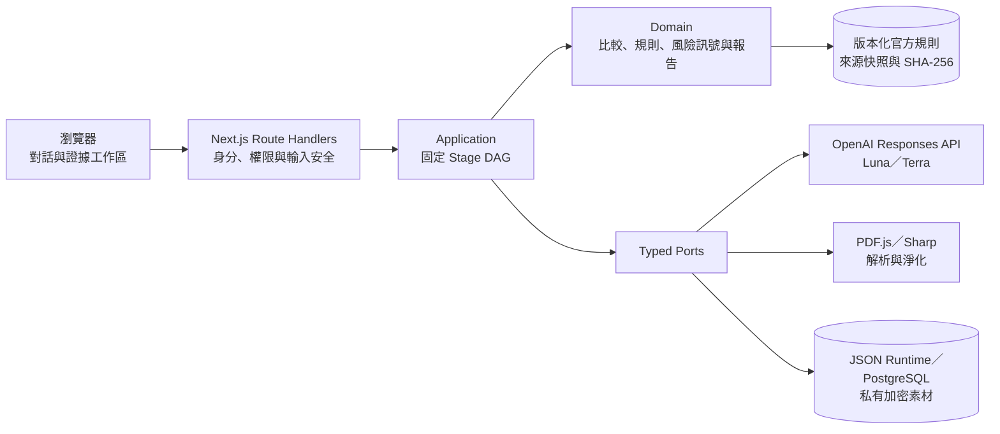

# 租得明白 RentProof

## 問題與目標

租屋資訊分散在廣告、看屋現場、租約與付款互動中，同一項設備、費用或承諾可能在不同來源出現落差。RentProof 協助準備付訂金或簽約的租屋者，把這些資料整理成可追溯的證據差異與待確認事項，讓尚未取得的證據也能在付款前被看見。

RentProof 提供資訊整理，不是法律意見，也不會直接判定詐騙、違法、漏水、結構安全或責任歸屬。

## 核心功能

- 以對話引導加入廣告、JPEG／PNG 看屋照片、30秒內MP4看屋影片、文字型 PDF 租約與付款互動資料。
- 將廣告承諾比對現場與契約證據，只輸出「支持、矛盾、證據不足」，並保留來源定位。
- 依版本化官方來源顯示「未發現差異、疑似差異、資料不足」，不作合法／違法判定。
- 區分固定月費、依用量計費與一次性費用；沒有用量時不虛構單一月總額。
- 顯示付款前風險訊號與具體查證行動，不輸出詐騙 verdict、機率或安全分數。
- 可從首頁導覽進入 115 年度租金補貼申請條件預檢；結果不等同主管機關正式資格或金額核定。
- 以四區證據工作區呈現物件摘要、證據矩陣、契約檢查與可列印的簽約前報告。
- 支援訪客直接使用；選用帳戶可保存、查詢及刪除自己的歷史案件。

## 系統架構



RentProof 採 TypeScript 模組化單體。Listing、Viewing、Evidence、Contract 等名稱代表固定、可追蹤的分析階段，不是自治微服務。模型只抽取非結構化候選資料與解釋已驗證內容；三態結果、官方規則、金額、風險訊號、優先序與報告皆由 Server 驗證或決定。完整設計見 [系統架構](docs/SYSTEM_ARCHITECTURE.md)、[技術設計](docs/TECHNICAL_DESIGN.md)與[安全與隱私](docs/SECURITY_PRIVACY.md)。

## 使用技術

| 類型         | 技術／服務                                                        | 用途                                                            |
| ------------ | ----------------------------------------------------------------- | --------------------------------------------------------------- |
| AI 模型      | `gpt-5.6-luna`、`gpt-5.6-terra`                                   | 對話意圖／唯讀說明，以及廣告、影像、契約與互動資料的結構化抽取  |
| 前端         | Next.js 16 App Router、React 19、Tailwind CSS 4、Radix Primitives | Conversation-first、mobile-first RWD、證據工作區與列印報告      |
| 後端         | Node.js 24、TypeScript 6、Zod、Kysely、PostgreSQL                 | Route Handlers、typed use cases、owner-scoped 儲存、規則與報告  |
| 文件／影像   | Mozilla PDF.js、Sharp、pinned FFmpeg                              | PDF抽取、圖片淨化，以及受限MP4探測、確定性抽幀與video locator   |
| Sponsor 技術 | OpenAI Responses API、Structured Outputs                          | Server-side 雲端模型呼叫、strict schema 輸出與 usage provenance |
| 測試         | Vitest、Testing Library、axe、Playwright                          | Domain、API、元件、accessibility、RWD 與端對端驗證              |

## 安裝與執行

### 環境需求

需求：Windows、Node.js `24.20.0`、pnpm `11.25.0`。

### 本機開發

```powershell
git clone https://github.com/borndaschen/RentProof.git
Set-Location RentProof
pnpm install --frozen-lockfile
pnpm env:check
pnpm dev
```

本機開發網址為 `http://127.0.0.1:3000`，HTTP 只綁定 loopback。Fixture 模式不需要 OpenAI API key；Live 模式需將 Server-only `OPENAI_API_KEY` 放在不提交的 `.env.local`，並完成明確的 Cloud 與 Project Gate。請勿使用 `NEXT_PUBLIC_*` 金鑰。

### Demo 與品質檢查

Demo 素材不在 repository 內。執行 Golden flow 前，需先在 `%USERPROFILE%\RentProof-Demo` 準備已封存素材，或以 `RENTPROOF_DEMO_DIR` 指向符合規格的既有目錄，再執行：

```powershell
pnpm demo:check
```

常用品質檢查：

```powershell
pnpm format:check
pnpm lint
pnpm typecheck
pnpm test
pnpm test:coverage
pnpm security:check
pnpm build
pnpm test:e2e
```

`pnpm test:e2e` 前須先完成 `pnpm build`。私人區域網路展示僅使用 `lan_secure_demo` HTTPS；完整憑證、Firewall、PostgreSQL 與啟停步驟見 [Server 配置](docs/SERVER_CONFIGURATION.md)。

## 作品展示

- 作品展示網址：目前未提供公開展示；僅支援本機 loopback 與受信任私人 LAN 的 HTTPS 展示。
- 評選影片：[Youtube](https://youtu.be/-m9WGyJiOYA)
- 原始碼：[GitHub repository](https://github.com/borndaschen/RentProof)

## 限制與未來工作

- [掃描 PDF OCR](docs/OCR_DESIGN.md) 的安全預檢、候選文字與人工確認邊界已完成，但一次性人工確認與後續契約抽取尚未接入使用者流程；目前契約仍要求清楚文字型PDF。
- [影片證據](docs/VIDEO_INGESTION_P1.md) 已在Secure LAN入口啟用：只接受50 MiB／30秒內MP4，使用已驗證鎖版FFmpeg探測與確定性抽幀，frame bundle加密保存並在分析時保留timestamp／frame locator；音訊不分析。
- 付款前風險檢查已涵蓋：拒絕當面帶看或只寄鑰匙、誘導點擊陌生連結或提供網銀／信用卡／驗證碼、收款人身分不明、尚未核對出租權限、高壓搶租話術、難以追回的付款方式、不同資料互相矛盾、異常低租金伴隨其他風險，以及導向陌生客服或LINE進行帳戶認證。系統只顯示風險訊號與查證建議，不判定詐騙或提供分數；沒有可靠的官方租金資料時，低租金項目會顯示資料不足。
- OCR、影片與分析工作已有單機持久化bounded queue與受治理worker：具10,000筆容量、全域同時2件、同案件同時1件、lease、有限重試、idempotency、重啟復原、cancel／purge及執行前owner／revision／policy／Cloud／budget Gate。多process／HA部署仍須改用具跨process transaction的adapter。
- 首頁導覽提供 115 年度租金補貼申請條件預檢；目前不試算核定金額或加碼倍數，且仍需主管機關正式審查。
- `lan_secure_demo` 不是正式公開服務；Production 仍需完成正式網域與憑證、Transactional Email 營運控制、排程式清除、異地加密備份、事件處理與部署驗證。
- 隱私政策、使用條款與 Cookie 政策均為 `DRAFT`；營運者資料、聯絡方式、處理地區、未成年人規則與爭議條款尚待補齊，並需台灣法務／隱私專業審閱。

## 第三方服務、資料與素材

- [OpenAI API](https://developers.openai.com/api/docs/)：依 OpenAI 適用條款使用 Responses API；每次 request 設定 `store: false`，但不宣稱等同 Zero Data Retention。
- [Next.js](https://nextjs.org/)／[React](https://react.dev/)：MIT License。
- [Mozilla PDF.js](https://mozilla.github.io/pdf.js/)：Apache License 2.0。
- [Sharp](https://sharp.pixelplumbing.com/)：Apache License 2.0；其相依元件依各自授權。
- [FFmpeg](https://ffmpeg.org/)：Secure LAN影片處理使用開發機repository外私有runtime中的已驗證GyanD GPLv3 build；binary不隨repository散布。
- [PostgreSQL](https://www.postgresql.org/)：PostgreSQL License；[Kysely](https://kysely.dev/) 與 [node-postgres](https://node-postgres.com/)：MIT License。
- 官方規則與補貼資料來自版本化政府來源；完整連結、查核日期與授權／引用說明見 [來源與揭露](docs/SOURCES_AND_ATTRIBUTIONS.md)及[官方規則](docs/OFFICIAL_RULES.md)。
- Golden Demo 素材為完全虛構內容，存放於 repository 外，不隨原始碼發布。
- 完整第三方套件授權盤點見 [第三方授權](docs/THIRD_PARTY_LICENSES.md)。Repository 不包含金鑰、Token、TLS 私鑰、真實租約或其他個人資料。

## 團隊成員

| 姓名   | 分工     |
| ------ | -------- |
| 陳銘寬 | 技術發想 |
| 陳致鈺 | 程式撰寫 |
| 劉惠怡 | 影像產出 |

## License

本專案原創程式碼與文件採 [Apache License 2.0](LICENSE) 授權，並保留 [NOTICE](NOTICE)。第三方套件、官方來源與 repository 外素材仍依各自授權或使用條件。
