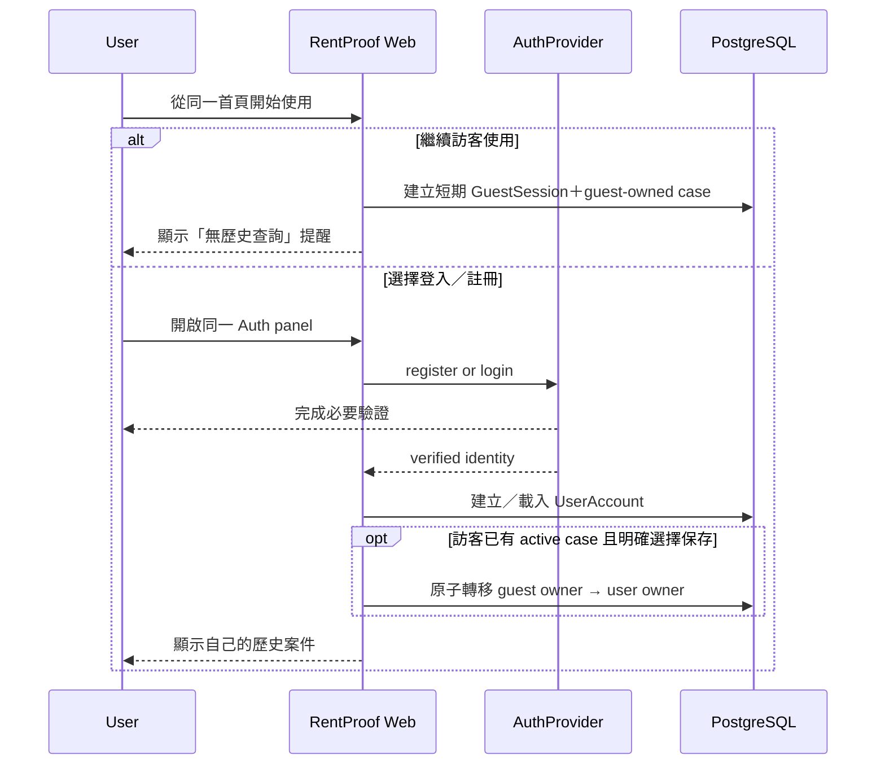
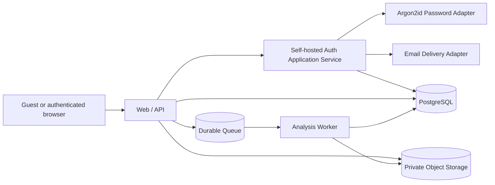

# RentProof 選用帳戶、登入與歷史租約架構

- 狀態：目前帳戶與訪客流程基線
- 日期：2026-09-03
- 單一入口：訪客不需帳戶即可使用；登入後才提供跨工作階段／裝置的歷史紀錄

本文件也定義政策版本與使用者事件的技術契約；政策文字見 [隱私政策草案](PRIVACY_POLICY_DRAFT.md)、[使用條款草案](TERMS_OF_USE_DRAFT.md) 與 [Cookie 政策草案](COOKIE_POLICY_DRAFT.md)。三份文件目前都不是已生效法律文件。

## 1. 登入是保存紀錄的選項，不是使用門檻

訪客可在同一個 RentProof 流程建立與分析案件，不必先註冊。系統在建立案件與上傳前都要清楚提醒：

> 目前未登入。這筆案件不會出現在歷史紀錄；如果工作階段失效、Cookie 被清除或更換裝置，可能無法再次查詢。請在離開前下載報告，或登入／註冊後選擇保存到帳戶。

登入的價值是讓系統跨 session／裝置辨識案件擁有者；要安全取得之前的租約資料，仍需要：

1. 持久化 PostgreSQL，保存案件、分析 runs、snapshots 與報告 metadata。
2. Private object storage，保存原始租約與 sanitized derivatives。
3. 每個 case 的 user／guest owner relationship 與 server-side authorization。
4. 受保護的 session、註冊驗證、登出與帳戶恢復。
5. Retention、case delete、account delete 與 audit。

只有登入畫面而沒有上述資料與授權邊界，不能安全提供歷史租約。訪客案件也不是公開資料：它使用短期、不可猜測的 server-side guest session，只允許同一工作階段存取並依明確期限自動清除。

目前已以`004_guest_sessions` migration建立獨立訪客工作階段資料表與固定期限constraint。訪客token為32-byte CSPRNG opaque value，資料庫只保存server-keyed HMAC-SHA-256 digest；建立與解析流程不會滑動到期時間。Web端在未登入時自動取得訪客工作階段，沿用同一個對話式案件介面，不另設第二個入口。

Conversation turns、typed candidates與confirmation events都屬case-owned資料，沿用相同guest／user owner authorization、retention與deletion；歷史清單不得載入conversation text。對話投影不能繞過case owner query，原始聊天也不作報告或安全稽核的替代來源。

Raw conversation text另採固定7天retention，到期隱藏並24小時內online purge；Guest 24小時、Formal Demo cleanup與case／account deletion等較短規則優先。Typed intent／candidate／confirmation／snapshot references可隨case保留，但不得保存可還原原文的excerpt／hash。歷史detail可用typed events重建，不從raw text建立搜尋索引。

## 2. Product profiles

| Profile             | Registration／login              | Data                                            | History                                                             |
| ------------------- | -------------------------------- | ----------------------------------------------- | ------------------------------------------------------------------- |
| `local_development` | 可啟用自建Auth；只限精確loopback | synthetic external Demo；Fixture／Live 明確設定 | PostgreSQL owner-scoped synthetic history                           |
| `lan_secure_demo`   | 自建Email／密碼Auth或訪客Session | 私有資料；PostgreSQL＋private storage           | Owner-scoped；帳戶可查歷史，訪客不可列出歷史                        |
| `production`        | 選用；訪客與帳戶共用單一入口     | 使用者真實案件                                  | 訪客無歷史查詢；登入者有 owner-scoped cross-session／device history |

Production profile 可建立 guest case，但不提供公開／無 session 的 case，也不允許 guest 列出歷史。Profile 由 deployment config 固定，不能由 query／UI 切換。

## 3. 身分供應策略：RentProof self-hosted Auth

D-089已取代Clerk決策。系統採Application ports＋PostgreSQL adapter的自建Email／密碼Auth；Clerk SDK、subject mapping、Dashboard設定與Session皆不再構成現行架構。帳戶功能只在精確loopback測試或`lan_secure_demo`／未來Production HTTPS環境開啟。

```ts
interface PasswordHasherPort {
  hash(password: string): Promise<string>;
  verify(passwordHash: string, password: string): Promise<boolean>;
  needsRehash(passwordHash: string): boolean;
}

interface SelfHostedAuthRepositoryPort {
  createAccount(input: NormalizedCredential): Promise<CreateAccountResult>;
  resolveAndTouchSession(input: SessionTouch): Promise<AccountSession | null>;
  consumeEmailVerificationChallenge(input: Challenge): Promise<VerifyResult>;
  consumePasswordResetChallenge(input: PasswordReset): Promise<ResetResult>;
  revokeAllUserSessions(userId: string, now: Date): Promise<void>;
}

type ActorContext =
  | { kind: "guest"; guestId: string; guestSessionId: string }
  | { kind: "user"; userId: string; sessionId: string };
```

- Email只作正規化登入identifier，不作owner key；RentProof內部不可變`userId`仍是owner subject。
- Domain不importArgon2、PostgreSQL、Cookie或Email delivery adapter。
- Email、密碼、verification／reset code、session token與Email delivery provider credential不送給OpenAI；初期不蒐集電話。
- OpenAI `safety_identifier` 如需使用，以內部 user ID 加 server secret 做 HMAC，不用 email／電話裸 hash。
- 只有infrastructure password adapter可import鎖版`argon2`；參數固定Argon2id `m=19456 KiB／t=2／p=1`，以套件隨機salt產生PHC字串並支援登入時安全rehash。
- Email正規化採trim、NFC與lowercase；密碼12–128字元且不做trim／Unicode改寫。超長、NUL或不合規密碼不送進Argon2，改用固定有界dummy candidate後回generic錯誤。
- Session與Email code使用256-bit CSPRNG opaque value；資料庫只保存以獨立32-byte server key計算的HMAC-SHA-256 digest。原值只存在HttpOnly Cookie或Email delivery boundary，不寫log、URL、OpenAI或browser storage。
- 註冊、登入與忘記密碼採generic回應、固定response floor與Actor／IP rate limit。Synthetic dev mailbox另綁高熵pre-auth browser context，Browser B不能取走Browser A的code。
- D-095選定個人Gmail API作為目前低量Transactional Email adapter，只使用`gmail.send` OAuth scope；Application不得保存Gmail密碼或App Password。實際OAuth app、寄件帳戶、處理地區、Google條款／隱私、退信與濫用處理仍是外部Gate；loopback Demo outbox不代表可寄真實Email。

## 4. 單一入口與選用註冊



註冊要求：

- 註冊以email為唯一初期識別；完成單次、15分鐘Email驗證前不得登入或保存歷史。初期不蒐集電話、沒有SMS Recovery；未來啟用需新增決策與Privacy Notice。
- 回應不能洩漏 email 是否已存在；provider／application 都需 rate limiting。
- 密碼以鎖版`argon2`的Argon2id保存，不自行設計密碼雜湊；Production另需breached-password檢查、credential-stuffing監控與Email delivery Gate。
- 使用者需接受 Terms 的明確版本，並分開記錄已取得 Privacy Notice；不得把兩者與非必要 Cookie 綁成單一勾選框。
- Cloud Processing Notice 在首次送出真實內容分析前再顯示，並記錄當時版本；註冊本身不應被誤解為已同意所有未來資料外送。
- 不要求真實姓名、身分證、電話或不必要profile資料。
- 訪客轉為帳戶 owner 必須同時持有有效 guest session 與新登入 session，並明確按下「保存到我的帳戶」；不能只靠 case ID 轉移。

## 5. 登入、guest session、登出與Email忘記密碼

- 帳戶與訪客皆使用RentProof server-managed opaque cookie，但使用不同名稱、key與資料表；禁止把session／refresh token或guest secret放入localStorage／sessionStorage。
- Cookie 使用 `Secure`、`HttpOnly`、明確 `SameSite=Lax` 或 `Strict`、host-only scope 與 `Path=/`。
- `lan_secure_demo`與Production的account／guest session使用HTTPS；登入／權限變更後rotate session ID。本機HTTP只允許loopback測試。
- Account Session採7天sliding idle expiry。只有通過owner／policy Gate的主動HTML mutation或明確案件／history操作可在單一原子DB statement延長server expiry，且同一成功response同步刷新Cookie Max-Age；`GET /api/auth/session`、prefetch、polling、靜態資源、健康檢查與失敗request不得延長。
- Guest Session自建立起固定24小時到期且不滑動；server只存opaque token hash，cookie不得晚於server expiry。到期後立即拒絕案件存取並停止未完成工作，所有線上案件資料於24小時內完成purge。
- 刪除帳戶、匯出敏感資料、變更Email／密碼等高敏感操作要求15分鐘內密碼reverification；不得以「Session尚在7天內」省略。
- Mutation routes 仍需 CSRF／Origin protection；SameSite 只是 defense in depth。
- Logout 必須 server-side invalidate session，不只清前端狀態。
- 「忘記密碼」初期只接受Email；畫面與response對存在／不存在帳戶使用一致訊息。SMS／phone route不存在或回`FEATURE_NOT_AVAILABLE`。
- Email verification／reset code由CSPRNG產生，15分鐘、單次、資料庫只存keyed digest，具嘗試上限、重送冷卻、rate limit與response floor；server／client logs不得記錄token／code。Loopback dev outbox取碼另綁pre-auth browser context，跨瀏覽器讀取拒絕。
- 成功驗證後才允許設定新密碼；重設完成不自動登入，並撤銷既有 sessions，再發送安全通知。若兩個管道都有綁定，通知可送往另一管道。
- Password reset challenge不建立RentProof user actor；完成時在同一transaction更新Argon2id hash、consume challenge並撤銷該帳戶所有sessions，且不自動登入。任一更新／撤銷失敗整筆rollback，case routes保持deny-by-default。
- 帳戶 email／credential 變更需要重新驗證，並提供撤銷其他 sessions 的能力。
- Guest session無法用Email恢復；失效後系統不能用租約內容、檔名或case ID幫訪客找回。
- Guest在有效期內可下載報告、刪除案件，或登入後明確執行原子transfer；單純登入不會自動改變案件owner或保存期限。
- Guest-to-user transfer要求同一瀏覽器同時持有有效guest session與最近15分鐘內完成登入／reverification的account session；使用者必須按下明確保存按鈕。PostgreSQL transaction同時鎖定兩個session與案件，更新case／artifact owner並增加revision；重播回獨立衝突碼。

帳戶案件不採閒置自動到期；在帳戶有效期間保存，直到使用者明確刪除案件或刪除帳戶。History與case detail必須提供刪除控制與範圍說明；刪除確認後立即自一般history與case routes隱藏且不可恢復，線上case／artifact／run／snapshot／report與適用第三方file objects須於7個日曆日內由冪等workflow清除。帳戶刪除涵蓋全部owned cases。加密backup／PITR最多保存14天；最小化deletion tombstone保存21天並在任何隔離restore開放流量前重播。必要security／legal retention與服務終止處理另行揭露。

Allowlisted security／deletion audit events自事件發生起保存180天，到期後24小時內purge。Audit只含事件、時間、結果、reason／correlation與pseudonymous internal references等最小metadata，不得保存案件內容或credentials；deletion audit不可作案件恢復來源。

以上原則依 [OWASP Authentication](https://cheatsheetseries.owasp.org/cheatsheets/Authentication_Cheat_Sheet.html)、[Session Management](https://cheatsheetseries.owasp.org/cheatsheets/Session_Management_Cheat_Sheet.html) 與 [Forgot Password](https://cheatsheetseries.owasp.org/cheatsheets/Forgot_Password_Cheat_Sheet.html)。

## 6. Guest／user owner authorization

Authentication 只證明帳戶「你是誰」；guest session 只證明「目前瀏覽器持有這個短期工作階段」。兩者每次 access 都要確認 case owner relationship。

```ts
interface AuthorizedCaseRepository {
  listOwned(userId: string, cursor?: string): Promise<CaseSummaryPage>;
  loadOwned(actor: ActorContext, caseId: string): Promise<CaseState | null>;
  saveOwned(actor: ActorContext, state: CaseState, expectedRevision: number): Promise<void>;
  transferGuestCase(input: {
    guest: Extract<ActorContext, { kind: "guest" }>;
    user: Extract<ActorContext, { kind: "user" }>;
    caseId: string;
  }): Promise<void>;
}
```

規則：

- 所有 case、artifact、finding、run、snapshot、report route 都從 `ActorContext` 開始查詢。
- 不允許先用全域 `caseId` load 再只在 UI 隱藏；repository query 本身包含 user／guest owner scope。
- `GET /api/cases` 歷史清單只接受 authenticated user；guest 不可列出、搜尋或跨裝置恢復案件。
- Nested resource 需同時驗證 `artifact.caseId`／`snapshot.caseId` 與 case owner。
- Opaque UUID 不能代替 authorization。
- Deny by default；不存在與非 owner 可統一回 404，避免洩露資源存在性。
- Guest case 的 opaque ID 或 Cookie 任一單獨存在都不能取代 server-side session 與 owner check。
- 管理員／客服存取不在初版；未定義前一律無權查看使用者租約或代訪客搜尋案件。

OWASP 將 authentication 與 authorization 明確區分，並建議每次 request 驗證權限與 object relationship：[Authorization Cheat Sheet](https://cheatsheetseries.owasp.org/cheatsheets/Authorization_Cheat_Sheet.html)。

## 7. Production data model

目前repository已接通feature-gated Kysely／node-postgres schema、owner-scoped case state、self-hosted credential／session／challenge、固定24小時guest session、private artifacts、policy／consent、deletion request、最小security audit adapter、guest-to-user原子轉移及可重試retention purge worker。`lan_secure_demo`可在HTTPS、loopback PostgreSQL、加密private storage與完整owner Gate下建立、上傳、分析、保存及刪除私有案件；Web process不自動migration。個人Gmail adapter已完成但尚未配置OAuth憑證或實寄；正式上線仍須完成排程器部署、off-host backup與Production Gate。

```text
UserAccount
  id
  authProvider
  providerSubject
  emailVerified
  status

RentalCase
  id
  ownerType: user | guest
  ownerSubjectId -> UserAccount.id | GuestIdentity.id
  displayName
  status
  revision
  activeSnapshotId

Artifact
  id
  caseId
  ownerType / ownerSubjectId
  storageKey
  lineage / hashes / MIME / bytes

PipelineRun / StageRun / AnalysisSnapshot / ReportSnapshot
  caseId
  ownerType / ownerSubjectId
  immutable versioned metadata

PolicyDocument
  id / type / version / locale / contentHash / canonicalUrl
  publishedAt / effectiveAt / status

PolicyEvent
  actorType / actorSubjectId / policyDocumentId
  eventType / occurredAt / sourceRoute / caseId? / analysisRunId? / processorListVersion? / auditRef

ConsentPreference
  actorType / actorSubjectId / purposeKey
  decision / cookiePolicyVersion / inventoryVersion / occurredAt

GuestIdentity / GuestSession
  opaque internal guestId / sessionTokenHash
  createdAt / expiresAt / lastSeenAt / purgeState

```

- Self-hosted Auth application service協調password、verification、session ports；PostgreSQL adapters保存Argon2id PHC hash、challenge／session keyed digest及internal user／case relationship，原始secret不落庫。
- `ownerType + ownerSubjectId` 在 root case 表作 authoritative relationship；denormalized nested owner 欄位只能作 defense／query optimization，需 consistency constraint。
- Raw lease bytes 不存 PostgreSQL；放 private object storage。
- History query 只回 authenticated user 的 sanitized summary，不回 guest cases、租約全文或 private object key。
- `PolicyEvent.eventType` 明確區分 `accepted`、`acknowledged`、`consented`、`declined` 與 `withdrawn`；不可把 Privacy Notice acknowledgement、Terms acceptance、Cloud Processing consent 與 Cookie preference 混成一個 boolean。
- Cookie 各用途的選擇放在 `ConsentPreference`，不是只記一個 policy event；拒絕與撤回也要保存，避免重複詢問或誤載入。
- 預設不把原始 IP、裝置 fingerprint 或 email 複製進 policy event；若法務／安全認定確有必要，需另記資料目的、保存期限與存取限制。

## 8. 政策版本與使用者選擇

### 8.1 事件語意

| 文件／選擇                     | 首次時點                                                           | 之後行為                                                                          |
| ------------------------------ | ------------------------------------------------------------------ | --------------------------------------------------------------------------------- |
| 使用條款                       | Guest 首次上傳前或帳戶註冊時，必須明確接受目前版本                 | 重大版本依法務判定要求重新接受；拒絕時提供匯出／刪除與可用功能說明                |
| 隱私政策                       | Guest 首次上傳前或帳戶註冊時顯示完整連結並記錄已告知／acknowledged | 重大變更明顯通知；只有在適用處理確實需要同意時才建立 consent event                |
| OpenAI Cloud Processing Notice | 註冊頁可預告，但不綁定註冊                                         | 首次 live analysis 前 just-in-time 顯示；版本綁定 case／run                       |
| 必要 Cookie                    | Guest／account session 建立前以政策告知                            | 用於 owner binding、登入／安全；刪除 Cookie、登出或拒絕受保護功能可停止           |
| Cookie 政策／非必要用途        | 政策可讀但不綁註冊；所有非必要用途預設關閉                         | 以 `purposeKey` 分類 opt-in／decline／withdraw；第一版不啟用 analytics／marketing |

### 8.2 資料契約

```ts
type PolicyType = "terms" | "privacy_notice" | "cloud_processing_notice" | "cookie_policy";

type PolicyDocument = {
  id: string;
  type: PolicyType;
  version: string;
  locale: "zh-TW";
  contentHash: string;
  canonicalUrl: string;
  status: "draft" | "published" | "retired";
  publishedAt?: string;
  effectiveAt?: string;
};

type PolicyEvent = {
  actor: { kind: "guest"; guestId: string } | { kind: "user"; userId: string };
  policyDocumentId: string;
  eventType: "accepted" | "acknowledged" | "consented" | "declined" | "withdrawn";
  occurredAt: string;
  sourceRoute: string;
  caseId?: string;
  analysisRunId?: string;
  processorListVersion?: string;
  auditRef: string;
};

type ConsentPreference = {
  actor: { kind: "guest"; guestId: string } | { kind: "user"; userId: string };
  purposeKey: "functional" | "analytics" | "marketing";
  decision: "granted" | "declined" | "withdrawn";
  cookiePolicyVersion: string;
  inventoryVersion: string;
  occurredAt: string;
};
```

- 只有 `published` 且 hash 與 deployed content 相符的版本可收集事件。
- Checkbox 不預先勾選；Terms、Cloud Processing 與非必要 Cookie 分開控制。
- Policy page 未登入也可讀；footer、註冊、登入、帳戶與 upload flow 都能返回目前版本。
- Policy event 是 append-only audit record；修正錯誤以新事件補充，不覆寫歷史。
- `UserAccount` 上可有目前版本 cache 供 UI 查詢，但不可取代 append-only policy events；Cloud Processing event 應綁定對應 case／run 與實際 processor-list version。
- 使用者撤回非必要 Cookie 後立即阻止未來載入；Cloud Processing 選擇改變時不再建立新的 live run，既有資料依刪除／保存流程處理。
- Policy 版本本身不進 OpenAI payload。

## 9. 歷史案件功能

### 9.1 Routes

| Method   | Route                                 | Purpose                                                |
| -------- | ------------------------------------- | ------------------------------------------------------ |
| `POST`   | `/auth/register`                      | 註冊／開始驗證                                         |
| `POST`   | `/auth/login`                         | 登入並建立 session                                     |
| `POST`   | `/auth/logout`                        | 撤銷 session                                           |
| `POST`   | `/auth/password-reset/request`        | 以Email發起重設；固定generic response                  |
| `POST`   | `/auth/password-reset/verify`         | 驗證單次 reset token／OTP                              |
| `POST`   | `/auth/password-reset/complete`       | 設定新密碼並撤銷舊 sessions                            |
| `GET`    | `/legal/:policyType`                  | 未登入也可讀 published policy                          |
| `GET`    | `/api/account/policy-events`          | 查看自己適用的政策版本／選擇                           |
| `POST`   | `/api/account/cookie-preferences`     | 更新非必要 Cookie 選擇                                 |
| `GET`    | `/api/cases`                          | 分頁列出自己的歷史案件                                 |
| `GET`    | `/api/cases/:caseId`                  | 讀取 owner-scoped case shell／active snapshot metadata |
| `POST`   | `/api/cases/:caseId/claim-to-account` | 有效 guest＋user sessions 下，明確保存目前案件到帳戶   |
| `DELETE` | `/api/cases/:caseId`                  | Case deletion workflow；需 E2E 驗證後才啟用            |
| `DELETE` | `/api/account`                        | Account deletion＋所有 owner data cascade workflow     |

`/auth/*`由RentProof presentation layer呼叫窄Application use cases；每個route仍需處理UserAccount onboarding、notice consent、exact Origin／CSRF、rate limit與安全redirect allowlist，不得直接讓database adapter決定HTTP結果。

### 9.2 History read model

```ts
type CaseHistoryItem = {
  caseId: string;
  displayName: string;
  coarseLocation?: string;
  status: "draft" | "analyzing" | "needs_attention" | "ready";
  updatedAt: string;
  activeSnapshotId?: string;
  openActionCount: number;
  sourceMode: "live" | "fixture";
};
```

- 預設按最近更新排序，使用 cursor pagination。
- Guest 對歷史 route 回 `AUTH_REQUIRED_FOR_HISTORY`，UI 顯示登入／註冊選項，不把它描述為案件不存在。
- List view 不載入原始圖片、契約全文、excerpts 或 fraud interaction。
- 點入case後預設進conversation；conversation result cards與四區workspace固定讀同一active snapshot。
- 被刪除／無權存取的案件不得由 browser cache 顯示；敏感 response `private, no-store`。

## 10. UI／RWD

使用單一網站入口，不改 case 內四個主 tab：

- `/`：所有人從相同起點開始；Server自動建立訪客工作階段，對話依序引導案件名稱、廣告、看屋照片與租約，header提供選用的「登入／註冊」。
- `/auth` panel／route：同一區塊切換登入、註冊與忘記密碼，不建立兩個互斥入口；Email／SMS recovery 是其中一步。
- Guest不需先選模式或通過登入提示即可開始；登入／註冊只作為保存與查詢歷史的選用入口。
- `/cases`：歷史案件；Desktop quiet table／list，Mobile cards。
- Account menu：帳戶、登出、隱私／資料刪除。
- `/legal/privacy`、`/legal/terms`、`/legal/cookies`：公開、可列印、正文 16 px 以上並顯示版本／生效日。
- Footer：所有 app／auth／showcase 頁都可到三份政策與 Cookie 設定；不以低對比小字隱藏。

可讀性延續 `UI_DESIGN.md`：正文至少 16 px、caption 至少 14 px、充足留白、44 px touch target，不以小字擠入 consent／security 提示。

## 11. Storage architecture



- Public production Web/API 不以 local JSON 作真實 history store。
- Upload 經 quarantine／sanitizer 後才進 private object storage。
- Object key 不含 email、原始檔名或可猜測 case data。
- Worker job payload 只傳 opaque IDs；worker 再用 user／guest owner scope 取得資料。
- Guest artifacts 與 user artifacts 使用相同 private storage／quarantine 安全標準；差別只在查詢能力與較短的自動 purge policy。
- Backup、retention、delete cascade 與 audit 都需明確設計。

## 12. Security tests

- Registration／password-reset Email enumeration與rate-limit tests；SMS／phone endpoints必須disabled。
- Account cookie的Secure／HttpOnly／SameSite、host-only scope；原始token不落DB，keyed digest不可反推，合格活動原子延長7天並同步刷新Cookie。
- 過期／撤銷session不能被Internal User cache、history或Client UI復活；passive status與polling不得延長。
- CSRF／Origin／open redirect tests。
- User A 不可讀、改、分析、預覽、下載或刪除 User B 的 case／artifact／snapshot／report。
- 猜中 UUID 仍回拒絕；nested resource cross-case reference 被拒絕。
- History list 只出現目前 user 的 cases。
- Browser／client logs／OpenAI payload不含session token、Email delivery provider credential、email、password或verification／reset code。
- Account recovery token 單次使用；回應不洩漏帳戶存在性。
- Password reset 不自動登入且撤銷舊 sessions；Email／SMS provider failure 不可繞過驗證。
- Email verification／reset challenge在完成前後都不產生RentProof `ActorContext`；reset完成撤銷全部sessions，只有重新登入可讀history／case。
- Guest A 不可讀 Guest B 或 User A 的 case；guest 歷史 list 被拒絕，guest session 失效後不可用 case ID 找回。
- Guest-to-user transfer 同時要求有效 guest＋user sessions 與明確確認，且只能執行一次。
- Case／account deletion 涵蓋 raw、derivative、cache、runs、snapshots、reports、objects 與備份限制告知。
- 註冊不能在未接受 Terms 時完成；Privacy Notice acknowledgement 為獨立事件。
- Cloud Processing Notice 未完成時不能建立 live analysis run，fixture／public showcase 不冒充同意。
- 非必要 Cookie 在 opt-in 前不存在；撤回後不再載入；第一版沒有 analytics／marketing request。
- Policy content hash／version 不符 deployed document 時 fail closed，不寫入 policy event。

## 13. Release Gate

第一個真實資料版本必須完成：

- Transactional Email provider／data-region／DPA設定、breached-password service與threat review；loopback synthetic outbox不得用於真實資料。
- 單一入口、guest session、Registration、Email verification、login、logout、7天sliding Session、reverification與Email password reset；SMS不在初期。
- PostgreSQL UserAccount／GuestIdentity／user-or-guest owner-scoped case schema。
- Private object storage、quarantine、sanitized derivative。
- 全 route authorization／IDOR regression。
- History list／case restore／same-snapshot views。
- Guest 無歷史提醒、guest purge、下載報告與可選的 guest-to-user case transfer。
- 三份政策完成營運資料與法務／隱私審閱，移除所有 `[待填]`、`[待定]` 與期限 placeholders。
- Terms acceptance、Privacy Notice acknowledgement、Cloud Processing consent 與 Cookie preference 版本分開記錄。
- Case deletion、account deletion、retention／backup policy。
- Audit／security events與 incident process。

Secure LAN目前已具備HTTPS、固定24小時guest session、owner-scoped private upload與到期拒絕能力。正式公開服務前仍必須完成自動化24小時online purge、Transactional Email、off-host backup、Production憑證／部署與法務隱私審閱；Secure LAN驗證不等同Production上線核准。
