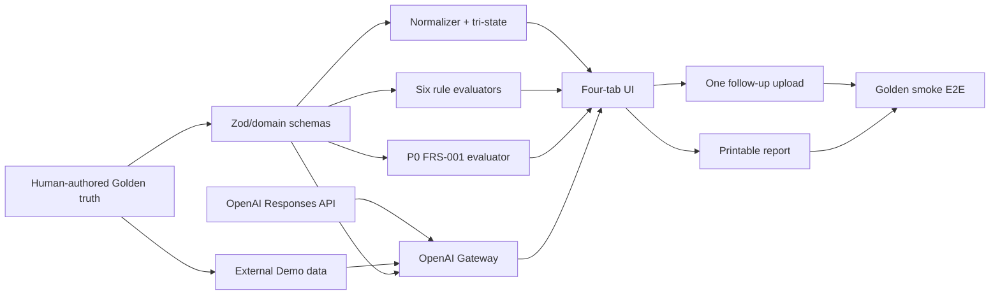

# 單人 MVP 實作計畫

- 狀態：P0 implementation complete；外部環境與真實資料release gates未完成
- 開發模式：1 位開發者，依相依關係循序完成

模組、目錄、依賴方向、ports／adapters、stage DAG、runtime layout與部署邊界依[系統架構](SYSTEM_ARCHITECTURE.md)實作；listener與HTTP LAN依[Server配置](SERVER_CONFIGURATION.md)。Golden flow仍以synthetic資料為P0邊界；self-hosted Auth／PostgreSQL已加入Demo-safe、feature-gated切片，first real-data release的單一入口、guest／user sessions、歷史與政策契約仍依[選用帳戶、登入與歷史租約架構](AUTH_AND_HISTORY.md)，不得因adapter存在就宣稱已可處理真實資料。

## 0. 目前實作快照

- `RP-DEV-001`至`RP-DEV-014`所需的Golden素材、Domain／Application／Adapters、四階段Fixture／Live分析、RWD conversation workspace、補拍局部重算、Windows JSON runtime及安全測試已實作；實際結果以最新 [開發紀錄](DEVLOG.md) 的驗證數字為準。
- 6條P0官方規則的allowlisted TypeScript evaluators、reason-code templates與regression tests已完成；規則內容仍維持DRAFT並在UI中標示，不代表法律審查。
- Self-hosted Auth ports／Argon2id adapter、Auth UI／Email verification與reset use cases、7天sliding account session、owner-scoped history service，以及Kysely＋node-postgres repositories、凍結migration與獨立migration命令已加入。它們是Demo-safe切片，不是Production完成宣告。
- Demo環境已實際套用`001_initial_real_data_schema`與`002_self_hosted_auth`，完成ACL finalization、12-table least-privilege readiness、owner隔離／CAS／cleanup、Auth HTTP端到端smoke、Firewall scope／enable／disable及LAN Host／Forwarded攻擊smoke。仍不得假裝完成的外部Gate包括：另一台實體LAN裝置的RWD／keyboard／200% zoom／screen-reader人工smoke、OpenAI Project限制確認、Transactional Email供應商／處理地區，以及Production政策填寫、off-host backup／purge與台灣法務／隱私審閱。
- 三份政策持續標示`DRAFT`。未完成真實資料Gate前，Demo只使用synthetic資料；不建立SMS／phone流程，也不把password、verification／reset code、session token或資料庫credential送往OpenAI或寫入log。

## 1. 完成定義

一個完全虛構案件必須能穩定完成：廣告抽取 → 看屋清單 → 12 張照片觀察 → 契約抽取 → 三方矩陣 → 6 條官方規則檢查 → synthetic 互動／付款要求 → 詐騙風險訊號 → 一次牆面補拍 → 可列印報告。

規則庫保留 10 條草案；P0 只啟用與 Golden case 直接相關的 `RP-003`、`RP-004`、`RP-006`、`RP-008`、`RP-009`、`RP-010`，其餘 4 條列為 P1。

Demo素材位於RentProof repository外的`%USERPROFILE%\RentProof-Demo`。App以`RENTPROOF_DEMO_DIR`覆寫或預設resolver唯讀；找不到資料夾時明確報`DEMO_DIR_MISSING`，不能自行建立或把素材複製回專案。

正式 Demo 從已分析完成的案件開始，不等待即時模型。分析腳本仍必須真實存在並能產生與 UI 相同 schema 的 `fallback/analysis.json`；人工真值獨立保存在 `truth/assertions.json`。畫面需清楚標示預先分析結果的建立資訊與版本。

## 2. 單人開發原則

1. 先定 Golden truth，再寫 schema、domain、UI；不以模型第一次輸出當真值。
2. P0 只做一個案件，不做通用案件列表、多租屋物件或多使用者。
3. P0 使用 12 張照片，不做影片、FFmpeg 或掃描 PDF OCR。
4. Golden P0使用typed repository interface＋記憶體／JSON state，不依賴ORM、migration或背景佇列；後續Demo-safe真實資料切片以獨立、feature-gated的Kysely／PostgreSQL adapter與operator-only migration驗證，不改變Golden runtime。
5. Demo 現場只上傳一組補拍照片；其他素材預先存在外部資料夾。
6. P0 Definition of Done 全部達成前，不開始 P1。
7. 防詐功能只提供 risk signals 與查證行動；不作詐騙 verdict、機率、黑名單或自動通報。

## 3. 執行順序與 Gate

| 階段              | 工作                                                                                                                                                                                                                                                               | 完成 Gate                                                                                                                                                                                                                                                                                                                                                                                                                                       |
| ----------------- | ------------------------------------------------------------------------------------------------------------------------------------------------------------------------------------------------------------------------------------------------------------------ | ----------------------------------------------------------------------------------------------------------------------------------------------------------------------------------------------------------------------------------------------------------------------------------------------------------------------------------------------------------------------------------------------------------------------------------------------- |
| A. Golden truth   | 定義 4 個廣告 claims、1 個現場 observation、P0 `FRS-001`、三態／補證狀態、locator、規則適用性與行動                                                                                                                                                                | 每個預期 finding／signal 由人明確寫出                                                                                                                                                                                                                                                                                                                                                                                                           |
| B. 外部 Demo 資料 | 製作廣告、文字型租約、12 張照片、補拍照、synthetic 互動／付款要求、truth manifest／assertions 與 fallback snapshot                                                                                                                                                 | 所有素材標示 synthetic、來源與授權；truth 與 fallback 不混用                                                                                                                                                                                                                                                                                                                                                                                    |
| C. 應用骨架       | 在目前Windows桌面電腦使用Node.js 24 LTS＋pnpm Scaffold Next.js 16 Active LTS／TypeScript 6.0／Vitest，配置ESLint Flat Config＋Prettier、server-only OpenAI config、Gateway interface、fixture mode、受限`lan_development`、conversation-first shell與四區workspace | `package.json.private=true`且專案採Apache-2.0 `LICENSE`／`NOTICE`；Node`24.x`、Next`16.x` security patch、TypeScript`6.0.x`、tool versions、`packageManager`／`pnpm-lock.yaml`鎖定；`.env.local` ignored／ACL最小、blank `.env.example`、secret scan通過；lint／format check／typecheck可獨立執行；Windows path／NTFS／Firewall smoke通過；App可啟動；缺key／model／Demo目錄明確報錯；client bundle無key；LAN public／wildcard bind fail closed |
| D. Domain         | 在TypeScript增強嚴格模式下建立Zod schemas、locator／Finding unions、FraudSignalCheck、PipelineRun／StageRun／Snapshot、reason codes、repository interface、normalizer、三態與evaluators                                                                            | Strict typecheck與Domain unit tests通過；無未驗證`any`／assertion；不執行自由文字規則                                                                                                                                                                                                                                                                                                                                                           |
| E. 分析流程       | OpenAI Responses adapters：Luna／low Conversation intent／explanation，Terra／medium Listing／Evidence／Contract／Interaction；usage／error metadata與fallback loader                                                                                              | 每個結果通過route schema；Evidence皆有locator；refusal／incomplete不會變成成功或跨模型fallback                                                                                                                                                                                                                                                                                                                                                  |
| F. 四畫面         | 依 `UI_DESIGN.md` 實作 mobile-first RWD、物件摘要、矩陣、現場觀察、契約、報告與 locator                                                                                                                                                                            | Golden 結果一致；RWD／字級／留白／accessibility Gate 通過                                                                                                                                                                                                                                                                                                                                                                                       |
| G. 補拍閉環       | JPEG／PNG 驗證、雜湊與牆面 finding 單項更新                                                                                                                                                                                                                        | 其他 finding ID／結果保持不變                                                                                                                                                                                                                                                                                                                                                                                                                   |
| H. 驗證與交付     | Golden smoke E2E、OpenAI failure matrix、P0 Security Gate、禁止措辭、locator coverage、列印、彩排與備份                                                                                                                                                            | Definition of Done 與 Security Gate 全部通過                                                                                                                                                                                                                                                                                                                                                                                                    |

## 4. 可直接執行的單人 backlog

| ID         | P   | Depends         | 驗收條件                                                                                                                                                                                                                                                                                                                                                                                                                            |
| ---------- | --- | --------------- | ----------------------------------------------------------------------------------------------------------------------------------------------------------------------------------------------------------------------------------------------------------------------------------------------------------------------------------------------------------------------------------------------------------------------------------- |
| RP-DEV-001 | P0  | —               | 建立 4 claims＋1 observation＋fraud signal truth、locator、案件適用性與預期結果                                                                                                                                                                                                                                                                                                                                                     |
| RP-DEV-002 | P0  | 001             | 外部`cases/golden-v1`完成listing／viewing／contract／follow-up／synthetic interaction素材、人工truth、fallback與strict JSON `manifest.json`＋raw-byte `manifest.sha256`；sealed版本immutable，由必填`RENTPROOF_DEMO_CASE_VERSION`顯式選版且不使用latest alias                                                                                                                                                                       |
| RP-DEV-003 | P0  | 001             | 以原生Node.js 24 LTS＋pnpm Scaffold Next.js 16 Active LTS／TypeScript／Vitest，不引入Docker／WAMP proxy／Windows Service；鎖定Node／Next security patch、package manager／lockfile，加入會實際傳遞host／port的validated launcher、OpenAI server config、live／fixture、loopback／`lan_development` profiles與四個tab shell；日常Dev Server、正式Demo Production Build，但`NODE_ENV`不得提升profile能力                              |
| RP-DEV-004 | P0  | 001,003         | Zod schemas、locator／Finding／FraudSignalCheck、PipelineRun／StageRun／AnalysisSnapshot types、ports                                                                                                                                                                                                                                                                                                                               |
| RP-DEV-005 | P0  | 004             | normalizer 與 tri-state engine 通過完整 truth table                                                                                                                                                                                                                                                                                                                                                                                 |
| RP-DEV-006 | P0  | 004             | 6 條官方 rule evaluators、P0 `FRS-001` evaluator、active profiles 與 applicability／result tests                                                                                                                                                                                                                                                                                                                                    |
| RP-DEV-007 | P0  | 002,004         | Demo／truth／fallback分離；Windows runtime預設`%LOCALAPPDATA%\RentProof\runtime`並驗證absolute fixed NTFS、ACL、overlap／UNC／removable／reparse拒絕；app-owned run manifest／lock，Development 7天cleanup、Formal Demo stop／abandoned cleanup；JSON atomic repository、case lock、revision／snapshot commit                                                                                                                       |
| RP-DEV-008 | P0  | 002,004         | PDF.js單份15 MiB／30頁／300,000字元逐頁文字／locator adapter、OpenAI adapter明確`service_tier: default`、16-attempt／concurrency-2／500K-input／50K-output-reasoning case budget，以及Listing／Evidence／Contract／Interaction requests與parser／refusal／incomplete／usage／errors                                                                                                                                                 |
| RP-DEV-009 | P0  | 003,005,006,007 | 以必要shadcn/ui＋Radix實作Mobile-first free-text conversation timeline／composer／typed confirmation cards與四區workspace；加入8 KiB／2,000 input、600-code-point／3-card output與remaining-count／workspace CTA、Desktop table／side view、Mobile cards／full-screen workspace、防詐查證及locator viewer；建立IME、Unicode、keyboard、duplicate-submit、prompt-injection、Vitest／Testing Library／user-event／jest-dom／axe tests |
| RP-DEV-010 | P0  | 005,009         | 以Sharp完成單張25 MiB／50 MP、案件400 MiB、每request一圖、3200 px derivative、magic bytes、realpath、auto-orient、re-encode、metadata strip、雜湊與單一observation finding更新                                                                                                                                                                                                                                                      |
| RP-DEV-011 | P0  | 005,006,009     | Hybrid response composer：Server鎖security／confirmation／results／stop-and-verify／priority／CTA；LLM只作source-bound read-only explanation；報告含來源、查證對象、完成條件與列印樣式且完全deterministic                                                                                                                                                                                                                           |
| RP-DEV-012 | P0  | 008–011         | Golden conversation E2E、LAN free-text、Actor＋IP rate／idempotency、10-minute confirmation、structured focus context、一般PII client／server warning＋payload-bound ack、auth secret／金融／QR hard block、candidate未確認不改state、direct／indirect injection、role spoof／leakage／JSON smuggling／Unicode／cross-case replay、`FRS-001`、OpenAI failures、禁止措辭與locator coverage                                           |
| RP-DEV-013 | P0  | all P0          | 文件、DEVLOG、錯誤修整與 Demo／OpenAI 環境清單                                                                                                                                                                                                                                                                                                                                                                                      |
| RP-DEV-014 | P0  | all P0          | 完成 `SECURITY_PRIVACY.md` 的 P0 Security Gate 與 secrets／log／client bundle scan                                                                                                                                                                                                                                                                                                                                                  |

## 5. 依賴關係

## 6. 品質 Gate

### Golden data

- 外部 Demo 目錄存在，manifest 中每個素材都標 `synthetic: true`、來源與授權。
- 四個廣告 claims、一個現場 observation、`FRS-001`、預期結果、locator 與補拍／查證行動均由人明確寫出。
- Demo 資料沒有出現在 RentProof 專案樹內。
- `truth/` 是人工 assertions；`fallback/` 是模型快照，版本／hash 不符即 fail closed。

### Domain 與規則

- 三態與 6 條規則的 unit tests 可獨立執行。
- Coverage分級Gate通過：核心Domain branches 100%／其他95%，Application 90%，Adapters／UI 80% lines-functions-statements／75% branches，全域85% lines-statements／80% functions-branches。
- 增強嚴格TypeScript flags全部啟用；Domain／Application無`any`逃逸，discriminated unions有exhaustive checks。
- Locator／Finding discriminated unions、same-case refs、金額 decimal／minor units 與 known／unknown／not_present tests 通過。
- PDF.js逐頁text items能產生穩定page／excerpt／position locator；損壞、加密、active-content、timeout與資源釋放cases fail closed。
- 適用性 unknown 一律為資料不足；not applicable 不會變成未發現差異。
- JSON state 能保存相同 schema 的 live 與 fallback 結果。
- OpenAI routing固定Conversation Luna／low、Evidence Terra／medium，皆`store:false`／`service_tier:default`；SDK retry不與adapter疊加，route failure不跨模型fallback。
- Budget分離且原子reserve／reconcile：Evidence 16 Terra attempts／2／500K／50K／US$2；Conversation fixed-24h 200 Luna attempts／1／500K／100K／US$0.50。Unknown usage保守停止，alerts不冒充實際帳單，Conversation超限不切Terra。
- 展示前核對Development OpenAI Project已設US$50／US$80 alerts與US$100 monthly hard limit；Runtime／CI沒有Admin Key，Production Project完全分離。
- 展示前核對Terra Project limits為30 RPM／500K TPM／40 IPM（若適用）／100 RPD，或帳戶Tier允許的更低值；Application concurrency 2與case budget仍生效。
- 展示前核對Luna Project limits為30 RPM／500K TPM／300 RPD（若Dashboard支援），或帳戶Tier允許的更低值；無RPD欄位需明示，Actor／IP 10 per minute、case concurrency 1與200-call window仍生效。

### UI 與閉環

- 每個 finding 都能點回廣告區塊、照片或契約頁碼。
- 補拍只更新牆面 finding，其他 finding 的 ID／結果不變。
- Conversation主流程、四區workspace與報告可在同一Golden case完成。
- Claim 三態與規則結果視覺分離；電費廣告／契約 locator 可並排。
- `FRS-001` 使用第三套標籤，不與 Claim／RuleCheck 合成分數；`stop_and_verify` 在報告優先。
- 360–1440 px、200% zoom、keyboard、reduced motion 與 A4 print 均通過；正文／表格不小於 16 px、caption 不小於 14 px。
- shadcn／Radix 元件僅從官方來源加入，generated diff 經審查；Dialog／Tabs／Accordion／form controls 通過 focus、keyboard、accessible-name 與 screen-reader smoke。
- Component tests與Playwright＋axe browser tests分層通過；jsdom無法驗證的contrast／layout／focus細節由真實browser與人工smoke涵蓋。
- 無全頁水平 overflow、擁擠 nested cards、重型圖表、風險分數或不必要動畫。
- `lan_development` 可由同一 private LAN 的 Mobile／Desktop 透過 HTTP 使用，持續顯示 synthetic-only banner，且不暴露 production auth UI。

### 交付

- Golden smoke E2E、禁止措辭與 locator coverage 全部通過。
- Coverage report與threshold config納入CI artifact；exclude／ignore變更需Review，百分比不取代Golden／安全斷言。
- Coverage使用V8 Provider與AST remapping；Vitest／coverage-v8版本一致，Windows／CI Node.js 24報告穩定。
- ESLint、Prettier check與TypeScript typecheck分開通過；不以Next build替代。
- OpenAI key、upload、prompt injection、model failure、HTML escaping、realpath／symlink 與 log redaction Gate 通過。
- LAN private-IP bind、Host／Origin allowlist、public／wildcard bind rejection、無 wildcard CORS 與 synthetic-only／auth-disabled Gate 通過。
- Windows Firewall只在Private profile開放RentProof指定LAN IP／port；依D-065允許整個Private網路來源，但Public／Domain profile、其他port與Router forwarding維持拒絕，並以另一台非展示LAN裝置驗證暴露邊界。
- Firewall Rule建立後預設disabled；Demo前後由不啟動Node的獨立elevated腳本enable／disable，launcher／checklist驗證scope與stale rule，Node process維持standard user。
- LAN manifest synthetic／hash allowlist：已列素材可使用；未知檔案與任意文字輸入回 `DEV_SYNTHETIC_ARTIFACT_NOT_ALLOWLISTED` 且不觸發 OpenAI。
- Demo 可依固定操作腳本穩定完成，並有備用錄影與 fallback JSON。
- 正式Demo以Production Build＋`lan_development`啟動，無HMR／source maps／詳細error overlay；仍為synthetic-only、Fixture預設且無Production credentials。
- 外部素材、環境設定與還原方式已有文件。
- Repository保留標準Apache-2.0 `LICENSE`與專案`NOTICE`；package維持private，第三方License／Notice清單完整，官方快照與外部Demo素材的權利不被專案授權覆蓋。
- D-046期間不建立／部署公開預覽；P0只做local／private LAN與備用錄影。`public_http_showcase`測試規格保留但不列入DoD，重新啟用需新決策。

## 7. P1 清單

- 30 秒 MP4、FFmpeg 抽幀與影片時間碼。
- 掃描 PDF、逐頁影像 OCR 與低品質文件處理。
- `RP-001`、`RP-002`、`RP-005`、`RP-007` 四條額外規則。
- 真實資料版完整營運：目前已有Kysely＋node-postgres Demo-safe adapter／migration／owner-scoped repository切片，並已在local synthetic database完成兩版migration與Auth／repository smoke；Production資料庫、備份、purge與多案件驗收仍屬P1。
- 通用上傳中心、自動purge、完整刪除E2E與進階EXIF稽核；P0的metadata strip與unit test已完成。
- 任意 finding dependency graph；P0 只支援固定牆面補拍閉環。
- 額外模型 eval fixtures 與完整 provider failure matrix。
- 反向圖片搜尋、資格／可疑網域受控查詢與手動 165 查證紀錄。
- 租金統計、P25／P50／P75 與成本情境試算。
- 公開部署、單一入口的 guest session＋選用使用者帳號、歷史案件與 private object storage。

### First real-data release backlog

P0 Definition of Done完成後，依下列相依順序實作；不設定工時或期限。`RP-REAL-001`至`RP-REAL-004`的Demo-safe切片已在local synthetic環境完成Argon2id、兩版PostgreSQL migration、owner-scoped repository與Auth HTTP端到端驗證；但Production級Transactional Email、真實資料storage／retention、營運設定與release security review尚未完成，因此這些ID仍不能整體標記為Production完成。`RP-REAL-005`至`RP-REAL-010`仍是未完成的release工作：

| ID          | Depends | 驗收條件                                                                                                                                                                                                                                                                                                                              |
| ----------- | ------- | ------------------------------------------------------------------------------------------------------------------------------------------------------------------------------------------------------------------------------------------------------------------------------------------------------------------------------------- |
| RP-REAL-001 | P0 Gate | Self-hosted Auth threat review；Argon2id參數與安裝來源、HMAC key管理、Email能力／data-region／DPA及7天sliding Session驗證；SMS延後，secret只進窄adapter                                                                                                                                                                               |
| RP-REAL-002 | 001     | 單一入口＋server-side `ActorContext`；guest 可使用，註冊／登入不是 upload blocker                                                                                                                                                                                                                                                     |
| RP-REAL-003 | 002     | 在同一Production Server以local-only PostgreSQL＋Kysely／node-postgres實作`UserAccount`／`GuestIdentity`／owner-scoped cases，DB port不對LAN／Internet開放，App／migration／backup roles分離；private quarantine／object storage與14天backup位於off-host不同故障域；Kysely Migrator採forward-only＋expand／contract                    |
| RP-REAL-004 | 002     | 以self-hosted Auth use cases在同一Auth panel完成註冊、Email驗證、登入、登出與Email password reset；無phone／SMS routes，Account Session採7天sliding idle expiry，reset challenge不建立ActorContext，完成時同一transaction更新hash、consume challenge並撤銷全部sessions後回登入；generic response、單次短效challenge與server-side auth |
| RP-REAL-005 | 002,003 | Guest notice、固定24小時non-sliding session、active-case access、無history list、到期立即deny與24小時內線上purge、下載報告及明確guest-to-user case transfer                                                                                                                                                                           |
| RP-REAL-006 | 003     | Authenticated `/cases` RWD history；清單不載入原文／照片，四tab綁定同一snapshot；案件保存至使用者刪除案件或帳戶，history／detail提供下載與明確刪除控制                                                                                                                                                                                |
| RP-REAL-007 | 002,003 | `PolicyDocument`／`PolicyEvent`／`ConsentPreference`、公開 policies、Cloud Processing just-in-time gate、necessary-only Cookie                                                                                                                                                                                                        |
| RP-REAL-008 | 003     | Case／account／guest purge E2E：raw chat固定7天＋24h online purge與typed-event保留、account刪除7日內、guest 24小時、每target冪等重試／SLA告警、backup最多14天、content-free tombstone 21天與restore replay、data-rights及180天security／deletion audit                                                                                |
| RP-REAL-009 | 002–008 | IDOR、CSRF、session fixation、guest hijack、enumeration、OTP replay／brute force、open redirect、cookie/network scan、安全 headers                                                                                                                                                                                                    |
| RP-REAL-010 | 001–009 | 三份政策填妥營運者、期限、供應商／地區、未成年人與爭議欄位，完成台灣法務／隱私審閱後才開啟真實資料                                                                                                                                                                                                                                    |

Release 行為：

- `/`／`/app/new` 是唯一產品入口；header 的登入／註冊只是保存歷史的選項。
- 建立 guest case 前與上傳區顯示「這筆資料無法在歷史紀錄查詢，session 遺失後可能無法找回」，但不把 guest 資料描述為公開。
- Guest history API 固定拒絕；客服也不能依內容、檔名或 case ID 代為找回。
- Email recovery為初期基本管道且不得洩漏帳戶是否存在；初期不建立phone／SMS route或蒐集手機號碼。
- Account Session使用7天sliding idle expiry，只有合格主動使用原子延長並刷新Cookie；Guest Session期限另由短期purge policy決定。
- Terms、Privacy Notice、Cloud Processing 與 Cookie purpose choices 分開，不以一個 checkbox 取得全部授權。

## 8. 不可降級項目

可以減少視覺裝飾、動畫與非 Golden flow 的空／錯誤狀態，但不可犧牲：

- 「未拍到」不能變成矛盾。
- 每項 finding 必須有 locator。
- 6 條啟用規則缺資料時必須回傳資料不足。
- 補拍閉環、三項優先報告與列印。
- UI 不得自動宣稱確定違法、確定詐騙、確定漏水、結構安全或責任歸屬。
- fallback 必須標示為預先分析結果，不能偽裝即時分析。
- OpenAI refusal、incomplete、schema／locator failure、auth／rate error 不能顯示為「沒有問題」。
- 詐騙風險訊號不能顯示為詐騙 verdict、機率、安全分數或自動通報；缺輸入只能是資料不足。
- P0 Security Gate 未通過前不接受真實資料。

## 9. 主要風險

| 風險            | 早期訊號                 | 緩解                                                               |
| --------------- | ------------------------ | ------------------------------------------------------------------ |
| 模型輸出漂移    | schema／locator 不穩     | Structured Outputs、Zod、reason code、外部 fallback                |
| 單人 scope 過大 | P0 尚未穩定就開始 P1     | 依 Gate 執行；P0 完成前不加入 P1                                   |
| PDF 定位遺失    | 條款有文字無頁碼         | P0 只收清楚文字 PDF；無 locator 即資料不足                         |
| 法規版本誤用    | source date／簽約日缺失  | 適用性 unknown 一律資料不足；保留 source metadata                  |
| Demo 網路失敗   | provider timeout         | Live mode 顯示失敗；操作者明確切換 Fixture mode 才載入預先分析結果 |
| 隱私或素材外洩  | Demo 檔案出現在專案樹    | 外部資料夾＋環境變數；公開前掃描 repository                        |
| 過度結論        | 畫面出現禁止措辭         | 固定模板、禁止詞測試、人工報告 review                              |
| 防詐誤判／誹謗  | 對人物或帳戶輸出詐騙標籤 | 只顯示訊號＋locator＋查證行動；不建立黑名單或公開分享              |

## 10. Definition of Done

- `RentProof-Demo/` 位於 RentProof 外，包含完全虛構的素材、人工 truth 與獨立 fallback snapshot。
- App 透過 `RENTPROOF_DEMO_DIR` 載入，缺少資料時不會靜默複製或生成。
- 四個廣告 claims 出現在三方矩陣；牆面是一個獨立 observation follow-up，結果符合 Golden truth。
- Synthetic 互動依時間線觸發 `FRS-001` 與 `stop_and_verify`，但 UI／報告不出現詐騙 verdict。
- 每項 finding 與 rule check 有 locator／來源、reason code 與版本。
- 6 條 P0 規則可執行，缺必要證據時回傳資料不足。
- 至少完成一次牆面補拍閉環，其他 finding 保持不變。
- Conversation可完成Golden流程、四區workspace可使用，報告可列印。
- RWD、清晰字級、寬鬆留白、WCAG 與極簡視覺符合 `UI_DESIGN.md` Definition of Done。
- Unit、Golden smoke E2E、locator coverage 與安全措辭測試通過。
- OpenAI Cloud使用Conversation Luna／low與Evidence Terra／medium，server-only key、Structured Outputs、route provenance、usage metadata及明確live／fixture均驗收通過。
- `SECURITY_PRIVACY.md` 的 P0 Security Gate 全部完成。
- 開發 server 預設 loopback；明確切換 `lan_development` 時只能以 HTTP private-IP＋synthetic data 運行，Firewall／Host／Origin／banner 與 auth-disabled checks 完成。
- Demo 能穩定依腳本完成，fallback 清楚標示。
- `README`、決策與 DEVLOG 反映單人實際狀態，未完成項目不標成完成。
