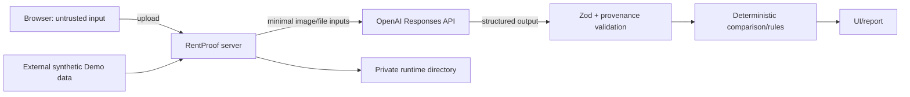

# RentProof 安全與隱私規格

- 狀態：目前安全基線＋LAN HTTPS私有案件基線
- 適用範圍：瀏覽器、RentProof server、外部 Demo／runtime data、OpenAI Cloud API

部署topology與後續worker isolation以[系統架構](SYSTEM_ARCHITECTURE.md)為準；listener、本機HTTP、LAN HTTPS、Firewall、Host／Origin與Production HTTPS invariants以[Server配置](SERVER_CONFIGURATION.md)為準。

## 1. 安全目標

RentProof 處理租屋影像與契約，安全目標依序是：

1. 不洩露 OpenAI API key 或上傳素材。
2. 不把不可信文件內容當成系統指令。
3. 不讓模型輸出越過證據、法律與責任邊界。
4. 每個結論可追溯、可重現，fallback 不偽裝即時分析。
5. 限制雲端傳輸內容、呼叫次數與意外成本。
6. 遇到未知、錯誤或適用性不明時安全降級為資料不足或 stage failure。
7. 真實資料版的訪客與登入案件都採私有 owner scope；不強制登入不等於允許公開存取。
8. 使用條款、隱私告知、OpenAI Cloud 告知與 Cookie 選擇可追溯且互不混用。

本機HTTP模式只供本機測試資料。`lan_secure_demo`可在使用者逐次同意雲端處理後接受私有租約／影像；它必須同時通過TLS、owner scope、PostgreSQL、加密私有儲存、檔案處理與OpenAI Live Gate，仍不等於正式公開服務。

## 2. 信任邊界

- Browser 輸入、檔名、廣告文字、圖片 OCR、PDF 內容與模型回傳都不可信。
- OpenAI API 是受控的外部資料處理邊界，不是本機服務。
- `RentProof-Demo/`與runtime都在repository／web public directory外；Windows測試runtime預設`%LOCALAPPDATA%\RentProof\runtime`，拒絕Demo overlap、Documents／OneDrive、UNC／network、removable與reparse paths，ACL限目前使用者／必要system principals。
- Development runtime最後寫入後最多保留7天；正式展示run正常結束清除、abandoned run下次展示前清除。Cleanup只刪validated root內有ownership marker且未active的child，先lock並重驗real path／volume／reparse；invalid quarantine bytes不等待7天。
- Demo directory 永遠 read-only；runtime application 不可讀 `truth/assertions.json`，只允許 tests／eval 使用 Golden truth。
- 未驗證 upload 先進 quarantine；parser／sanitizer 通過後才產生正式 derivative，OpenAI 只接收 derivative／必要文字。
- Rule YAML 是人工治理的受信任設定，但仍需 schema 驗證與版本鎖定。

## 3. 威脅與控制

| 威脅                                     | 目前控制                                                                                             | 安全失敗方式                                                             |
| ---------------------------------------- | ---------------------------------------------------------------------------------------------------- | ------------------------------------------------------------------------ |
| API key 外洩                             | server-only `OPENAI_API_KEY`、無 `NEXT_PUBLIC_`、`.env` ignore、公開前 secrets scan                  | 啟動失敗，不接受 client 提供 key                                         |
| 任意 endpoint 外送                       | 不提供使用者可控 `base_url`，adapter 固定 OpenAI HTTPS endpoint                                      | 設定不符 allowlist 時拒絕啟動                                            |
| Path traversal／symlink escape／惡意檔名 | 隨機 server filename、忽略原始路徑、realpath 後確認仍在 runtime root、拒絕 symlink                   | 拒絕檔案並回穩定 error code                                              |
| 假 MIME／超大檔案                        | magic bytes、允許清單、單檔與案件上限                                                                | `UNSUPPORTED_MEDIA`／`FILE_TOO_LARGE`                                    |
| 公開取得原始素材                         | 不放`public/`；私有案件route逐次驗證guest／user owner scope                                          | Session或owner不符即拒絕，不因持有opaque ID放行                          |
| Prompt injection                         | 文件包裝為 untrusted data、developer instruction、無工具權限、Structured Outputs                     | schema／provenance 失敗，不執行來源指示                                  |
| 模型幻覺／過度結論                       | locator 必填、Zod、三態 truth table、規則引擎、中立模板、禁止措辭測試                                | 降為資料不足或人工確認                                                   |
| Refusal 被當成沒問題                     | refusal／incomplete／schema invalid 各有 reason code                                                 | stage failure，不產生「未發現差異」                                      |
| 重複呼叫與成本失控                       | input hash cache、stage allowlist、request count 上限、OpenAI Project spend／rate controls           | 停止新呼叫並使用明示 fallback                                            |
| Log 洩漏                                 | 只記 ID、hash、版本、usage、error code；不記 key、Authorization、完整 prompt／租約                   | 敏感欄位一律 redact／drop                                                |
| Fallback 混淆                            | 顯示建立資訊、model／schema／ruleset 版本與「預先分析」標籤                                          | 無 provenance 的 fallback 不載入                                         |
| 規則過期／誤用                           | effective／verified date、來源 hash、三態 applicability                                              | unknown 一律 `missing_information`                                       |
| SSRF／廣告爬取                           | 不 fetch 任意 URL，只保存 metadata                                                                   | URL 不觸發任何 server request                                            |
| 防詐訊號誤判／誹謗                       | 只輸出風險訊號與查證行動、locator 必填、禁止詐騙 verdict／機率／公開名單                             | 資料不足或人工查證，不對人物／帳戶貼標籤                                 |
| Guest case 被猜中／接管                  | 高 entropy opaque session、server 只存 token hash、owner-scoped query、同一 guest 不可列出歷史       | session／owner 不符統一拒絕，不以 case ID 恢復                           |
| 帳戶／恢復流程枚舉                       | 註冊與Email reset使用generic response、rate limit、重送冷卻                                          | 不透露email是否存在                                                      |
| Reset token／code被重放                  | 短效、單次、attempt limit、成功後撤銷既有sessions、token不進log                                      | challenge失效；必須重新發起                                              |
| 條款或同意紀錄混淆                       | versioned content hash＋typed policy event；Terms／Privacy／Cloud／Cookie 分離                       | 版本或 hash 不符 fail closed，不建立 live run                            |
| 非必要追蹤提前載入                       | 第一版 necessary-only；未來 script／tag 在 opt-in 前不載入                                           | 拒絕部署或自動化 Cookie scan 失敗                                        |
| LAN傳輸或Server身分被冒用                | `lan_secure_demo`使用受信任TLS憑證、exact HTTPS origin／Host、Private-profile Firewall與禁止對外轉發 | 憑證、信任鏈、私鑰ACL或TLS檢查失敗即拒絕啟動                             |
| LAN Server 曝露公網                      | 拒絕 `0.0.0.0`／`::`／public bind、exact Host／Origin、禁止 router port forwarding／UPnP             | Startup fail closed；網路檢查不通過不得展示                              |
| LAN Client 濫用 Live API 成本            | Fixture 預設；Live 顯式啟用、request／case／concurrency limit與 OpenAI Project spend control         | 超限停止新 stage，不載入隱性 fallback                                    |
| Public HTTP Showcase遭MITM／內容竄改     | 完全靜態Synthetic、無秘密／輸入／帳戶／Cookie／API，持續integrity warning；不作正式證據              | 任何dynamic／sensitive capability出現即Build Gate失敗；Production仍HTTPS |

## 4. OpenAI Cloud 安全基線

- 只使用 server-side 官方 SDK 與 Responses API。
- Conversation固定`gpt-5.6-luna`／low，Evidence extraction固定`gpt-5.6-terra`／medium；model／effort依route allowlist驗證且不得cross-route fallback。
- 每次 request 明確 `store: false`，且不使用 Conversations、Assistants、vector store、background mode、web search、MCP 或其他工具。
- `RENTPROOF_LLM_MODE` 明確選 `live`／`fixture`；live 失敗不自動 fallback，fixture 不讀 key 且不發網路。
- 圖片／PDF 只傳分析所需頁面與畫面；不傳無關人臉、證件、簽名、電話、完整門牌或私人照片。
- Live analysis不論guest／登入，都要在首次外送前顯示「資料會送往OpenAI Cloud」及當時版本，完成所需事件後才可送出。
- `store: false` 不等同 Zero Data Retention。OpenAI 官方資料控制文件說明 API 預設不以客戶資料訓練（除非 opt in），但 abuse monitoring／應用狀態仍依帳戶與功能設定處理：[OpenAI Data controls](https://developers.openai.com/api/docs/guides/your-data)。
- 若未來使用 `/v1/files`，保存 file ID、設定到期或完成後刪除；目前優先使用 request 內的 file／image input。
- 公開部署使用獨立 OpenAI Project／key，設定支出與 rate controls；不共用個人通用 key。
- SDK logging 只允許不含 request／response body 的層級；禁止 debug body log。

## 5. 上傳與檔案處理

目前允許：

- 廣告：JPEG／PNG。
- 看屋與補拍：JPEG／PNG。
- 契約：清楚文字型 PDF。
- 互動／付款要求：完全虛構的貼上文字或遮蔽後 JPEG／PNG；不得含真實姓名、電話、帳號、OTP、QR code 或身分文件。

必要檢查：

- 驗證 magic bytes 與解析器實際格式，不只看副檔名或 `Content-Type`。
- 限制頁數、像素、單檔大小與案件總量；實際數值在實作時集中設定，不散落各 route。
- 圖片固定每張25 MiB／50 MP、每案件原始圖片400 MiB、每request一張；Sharp derivative最長邊3200 px且不放大。Server端stream、decoder與repository均驗證，client宣告不具安全效力。
- 契約PDF固定單份15 MiB、30頁、抽取文字300,000字元、每request一份；stream、PDF.js document與text aggregation分層限制。容量合格不代表內容安全，掃描／加密／active-content／無頁碼定位仍拒絕或要求補件。
- 解碼圖片後再產生新檔，移除不必要metadata；測試素材也遵循相同流程。
- PDF 不執行內嵌 JavaScript、附件、表單動作或外部連結。
- 不使用使用者檔名作 filesystem path；原始檔名只作經清理的顯示 metadata。
- Demo／runtime root 與每個目標路徑都要 realpath 驗證；測試 symlink／junction 逃逸。
- SHA-256 用於去重與 analysis cache，不作授權 token。

## 6. 模型輸出安全

每個 cloud stage 都必須：

1. 使用獨立最小 JSON Schema。
2. 通過 Zod validation。
3. 驗證每個 `artifact_id` 確實屬於本次 request。
4. 驗證 locator 在頁碼／圖片範圍內。
5. 把 refusal、incomplete 與低 confidence 明確建模。
6. 只輸出 observation／candidate semantic key，不直接輸出法律結論。

下列內容永遠由本機程式處理：三態、金額、官方規則、priority、報告行動模板與禁止措辭。

## 7. 使用者介面安全

- 上傳前顯示雲端處理告知、資料最小化提醒與可取消操作。
- 不顯示整體風險分數、物件安全分數或「可以放心簽約」。
- Claim 三態與官方規則三結果使用不同標籤／色彩與說明。
- 詐騙風險訊號使用第三套標籤；不得與 Claim／RuleCheck 合成分數，也不得顯示「詐騙者」或公開可疑帳戶／人物。
- 模型錯誤不能顯示為零風險、無矛盾或已完成。
- 所有 external link 使用安全屬性，官方來源 URL 來自規則 registry，不接受模型自造 URL。
- Report 輸出需要 HTML escaping；不得渲染來源中的任意 HTML／script。
- 互動內容中的 URL 預設不可點擊、不 preview、不 fetch；只作經 escaping 的文字證據。
- 建立 guest case 前顯示「不會出現在歷史紀錄，session／Cookie 遺失後可能無法找回」，同時說明案件仍是私有資料。
- Guest notice 提供繼續使用與選用登入／註冊，不得強迫註冊或以 dark pattern 隱藏訪客選項。
- Password reset 對帳戶存在性使用相同 UI；電話只遮蔽顯示，OTP／reset token 不出現在 URL、analytics、client log 或 error report。
- 三份政策公開可讀；第一版沒有 analytics／marketing Cookie，必要 Cookie 與非必要選擇不得混淆。

## 8. 本機測試與LAN HTTPS Security Gate

以下全部完成，對應profile才可展示：

- 瀏覽器 bundle 與靜態檔案不含 `OPENAI_API_KEY`。
- Windows Development `OPENAI_API_KEY`只可存在Scaffold後的repo-root `.env.local`，必須ignore、最小NTFS ACL及source／build／artifact secret scan；repository只有blank `.env.example`。Fixture不讀key、不組裝live adapter／不發網路，Production不使用Development檔案。
- Demo／runtime 目錄不在 repository 或 `public/`。
- Upload magic bytes、大小、路徑與 PDF 安全檢查有測試。
- Prompt injection fixture 不會改變 schema、規則或安全措辭。
- Conversation user／assistant text一律是不受信任資料，只能產生schema-validated candidate；raw Markdown／HTML、工具指令、URL或文件內指示不得執行。未確認candidate不得改case，client不得提交結果狀態或stage選擇。
- Free-text composer在LAN HTTPS亦開放，但需限制bytes／characters、Unicode normalization、turn rate與concurrency；escape所有輸出，拒絕raw HTML／data URL／script。私有資料仍須通過owner scope、Cloud consent與secret hard block，不宣稱能偵測所有個資。
- Live intent extraction固定`tools: []`、最小structured context、`store: false`與Strict Structured Outputs；Conversation／document prompts分離。Server重驗intent／fields／owner／policy／revision，material candidate以opaque confirmation ID＋payload hash＋expiry綁同actor；ambiguous／injection／refusal／incomplete／schema invalid不執行command。
- Conversation turn在transport層最多8 KiB strict UTF-8，拒絕NUL，NFC後最多2,000 Unicode code points；超限不截斷、不保存／log／audit、不呼叫模型。附件只走獨立MIME／size／hash upload boundary，拒絕turn內base64／data URL。
- Conversation疊加Actor與source-IP token buckets（10／minute、burst 3），每case concurrency 1；invalid／injection／oversize attempt仍計IP abuse bucket。Idempotency key綁actor／case／payload hash，防重播與cross-case reuse；limiter失效時Live fail closed。
- Material confirmation ID為opaque、one-time、10分鐘TTL，綁actor／case／revision／candidate type／payload hash並以atomic consume防race；不用URL、不寫log。Session／owner／policy／revision改變fail closed，高影響操作另做reverification。
- Model context不含recent／full raw chat；只含current normalized turn、allowlisted structured state與actor／case／snapshot validated focus refs。Cross-case／stale／unknown focus拒絕，ambiguous不猜測；context schema／hash可稽核但raw text不進log。
- LAN一般PII pattern採warning／allow：client先警告，Server回`PII_WARNING_REQUIRED`，ack綁actor／case／revision／payload hash、10分鐘、one-time。明確告知第一次HTTP request已可能暴露且偵測有false negative；未命中不代表安全。
- Auth／recovery secrets、API／Authorization／session tokens、private keys、完整金融帳號與QR／data URL使用不可ack的hard block；raw value不persist／log／audit／model。Detector reason code與pattern version可記錄，但不得記錄matched text。
- Raw conversation text固定7天、到期hidden且24小時內online purge；Guest／Formal Demo／case delete較短規則優先。Typed refs可保留，但excerpt／embedding／index／reversible hash禁止。Backup restore需以21天retention tombstone清除已過期turn，raw text永不進security audit。
- Hybrid response將security／policy／confirmation／results／priority／CTA鎖在Server templates。LLM explanation只讀verified facts／locators且每segment需source refs／insufficient reason；禁止產生actions／cards。Same-snapshot refs、forbidden phrases與semantic eval失敗均回Server safe template。
- Refusal、schema invalid、rate limit、網路失敗不會顯示成「沒有問題」。
- 所有肯定 finding 有有效 locator。
- 禁止措辭與 HTML／script escaping 測試通過。
- OpenAI usage、request ID、model、effort 與 error code 可追蹤，但 log 無原始敏感內容。
- 全部推論參數、preprocess hash 與 dependency hash 進入 StageRun／AnalysisSnapshot／cache key／fallback provenance。
- Fallback 有來源 hash 與清楚標示。
- Repo secrets scan 通過；Git／公開 repository 仍依使用者指示暫停。
- `local_development`的HTTP只bind loopback；`lan_secure_demo`對外只bind明確private IP的HTTPS 3443，內部Next.js只bind loopback 3100。`public_http_showcase`停用；`production`不允許Fixture且強制HTTPS。
- LAN TLS、Host／Origin exact allowlist、public／wildcard bind rejection、無wildcard CORS、Windows Private firewall指定IP／port與禁止port forwarding有自動檢查或展示前checklist。
- LAN Firewall Rule依D-066保留但預設disabled；獨立elevated腳本只切換／驗證Rule，不啟動Node。正式Demo前後與異常恢復checklist需確認enabled期間最短化，stale enabled rule必須告警或fail Gate。
- LAN私有案件頁不得暴露工程模式標籤；安全狀態由Server profile、TLS、Secure Cookie、owner query與啟動Gate強制，而不是依賴提示文字。
- LAN upload接受JPEG／PNG與文字型PDF，經stream limit、magic bytes、Sharp／PDF.js、SHA-256及owner Gate後，以AES-256-GCM加密保存於repository外；AAD綁定案件相對路徑。對話文字不得直接成為artifact／evidence／payment fact。
- `public_http_showcase`輸出必須為static export；bundle／network scan確認無Route Handler、Server Action、OpenAI／identity／storage key、upload、form、Cookie、browser storage、service worker、source map或third-party script。頁面persistent HTTP integrity warning＋noindex。

## 9. 正式公開部署前的剩餘Gate

LAN HTTPS私有案件流程已具備guest／user owner scope、自建Auth、加密素材與受控OpenAI分析；以下事項仍須在正式公開服務前完成：

- Transactional Email供應商、處理地區、DPA、退信與濫用處理；SMS／phone功能維持disabled。
- 可操作的排程purge、異地加密backup／PITR與restore驗證；現有同步刪除與資料庫設計不能取代營運工作。
- Cloud Processing Notice、Terms acceptance、Privacy Notice acknowledgement 分開版本化；Cookie 依 purpose 記錄 granted／declined／withdrawn；三份政策移除 placeholder 並完成台灣法務／隱私審閱。
- OpenAI Project 的實際 data controls、ZDR／MAM eligibility（若需要）與區域需求核對。
- Rate limit、spend limit、abuse monitoring、事件記錄與 key rotation 流程。
- 依賴鎖定、dependency audit、SAST／secret scan 與安全更新流程。
- 安全事件處理、通報與使用者資料刪除驗證。

未完成此Gate前，`lan_secure_demo`不得被描述或部署為正式公開服務。

## 10. Guest、帳戶與政策安全契約

- Production 採單一入口。`ActorContext` 只能是有效 `guest` 或 `user`；沒有 actor 的 request 不可建立、讀取或修改真實案件。
- 本節適用`lan_secure_demo`及HTTPS Production。本機HTTP只綁loopback；任何guest／account actor、註冊、登入、Email recovery、歷史或7天session都必須通過HTTPS、Secure Cookie與owner-scoped authorization Gate。
- Guest cookie 是必要 session，不是長期帳戶；使用高 entropy opaque token，server 只存 hash，設定 `Secure`、`HttpOnly`、明確 `SameSite` 與最小 scope。
- Guest Session固定24小時且不滑動，Cookie expiry不得超過server expiry。到期或主動刪除後立即拒絕存取、停止未完成工作，並在24小時內purge所有線上case／artifact／run／snapshot／report資料與適用第三方file objects。
- Account session使用256-bit opaque Cookie與PostgreSQL keyed-digest record，合格主動使用後原子延長7天idle expiry並同步刷新Cookie；passive status／prefetch／polling／失敗request不延長。Logout、password reset、帳戶停用／刪除立即撤銷，過期session不能由Internal User cache復活。
- 高敏感帳戶操作要求15分鐘內重新輸入密碼並以Argon2驗證，不能只因Session仍有效就省略。
- Guest case 只允許同一 session 存取，不出現在 `/api/cases`；遺失 session 後客服與 API 都不得依檔名、內容、hash 或 case ID 代為搜尋。
- Guest-to-user transfer 同時驗證 guest owner 與新的 authenticated user，需明確確認並以 transaction 原子完成；轉移後舊 guest access 立即失效。
- User-owned case在帳戶有效期間保存至使用者明確刪除案件或帳戶，不採閒置自動到期。確認刪除後立即deny且不可由使用者恢復；PostgreSQL案件內容、private objects、cache、runs、snapshots、reports、index與適用第三方file objects須於7個日曆日內由冪等workflow清除，接近／超過SLA需告警。
- PostgreSQL／object backups與適用PITR logs加密且自建立起最多保存14天，只允許break-glass災難復原角色存取。Deletion tombstone保存21天，僅含opaque references、target、event與時間；restore必須在隔離環境重播tombstones並通過deletion／owner invariant後才能開放流量。
- Security／deletion audit event使用欄位allowlist、append-oriented storage與獨立最小權限，自事件起最多保存180天並於到期後24小時內purge。不得寫入案件內容、PII identifiers、request body、prompt／output或authentication secrets，也不得成為已刪案件的恢復來源。
- 帳戶密碼只交給受控Argon2id adapter；Email verification／reset code與session token只交給對應窄adapter，均不送OpenAI或寫log。初期不建立SMS／phone欄位、route或保存流程。
- 密碼重設完成後不自動登入，撤銷既有 sessions 並發送安全通知；任何 provider failure 不得繞過 challenge。
- Email驗證／reset challenge永遠不產生user actor。Reset完成在同一transaction consume challenge、更新密碼並撤銷全部sessions；失敗整筆rollback且不允許查看case／artifact／report，也不自動登入。
- `PolicyDocument` 綁定 type、version、locale、content hash、published／effective time；`PolicyEvent` 區分 accepted、acknowledged、consented、declined、withdrawn，Cloud event 可綁 case／run／processor-list version。
- Privacy Notice acknowledgement 不得被當成概括同意；非必要 Cookie 預設關閉且不與 Terms 綁定。
- 受託處理者未填妥前，政策草案不得標示為已生效；Guest期限為24小時Session＋24小時線上purge SLA，帳戶案件保存至使用者刪除且刪除後7天內完成線上purge，backup最多14天、tombstone 21天、security／deletion audit 180天。
