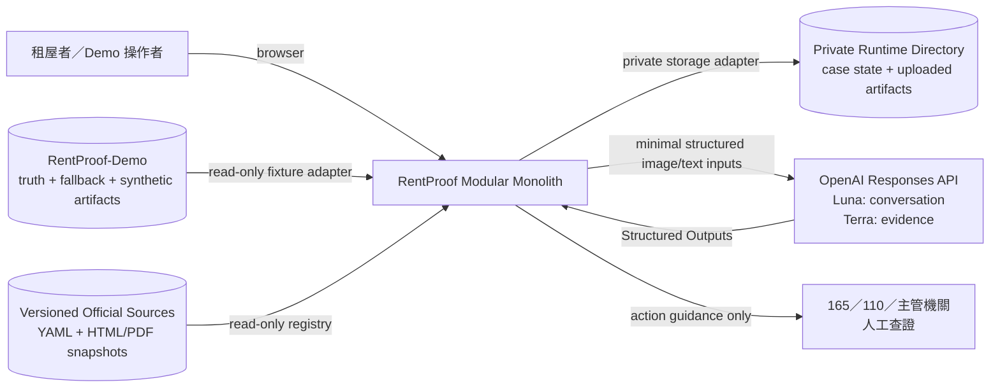
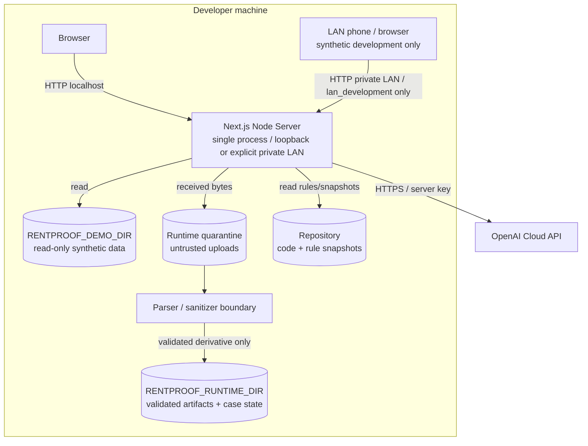
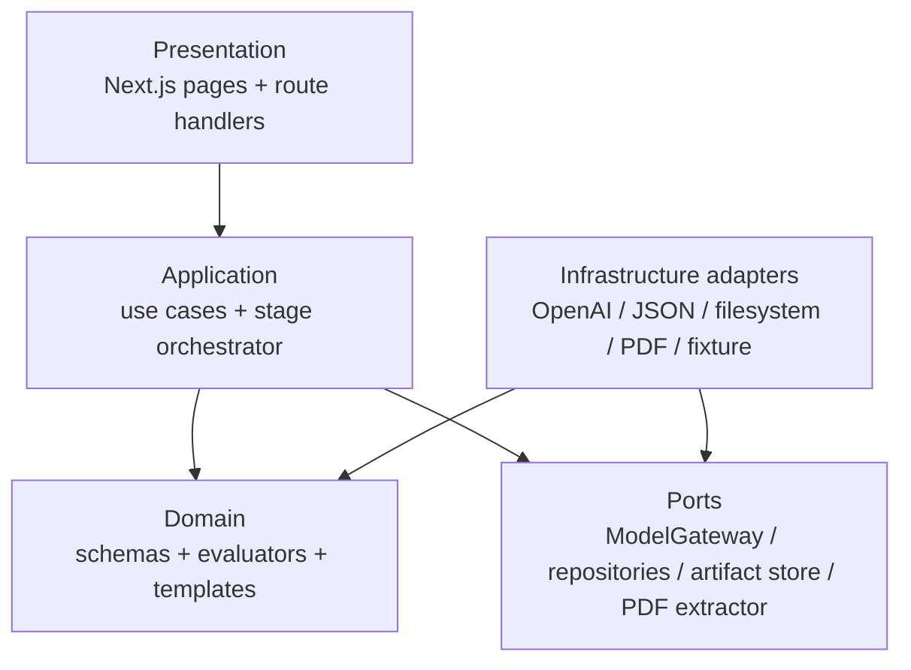
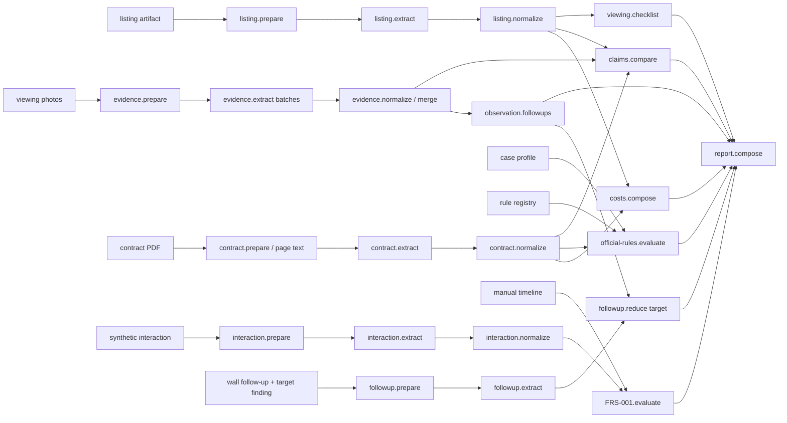
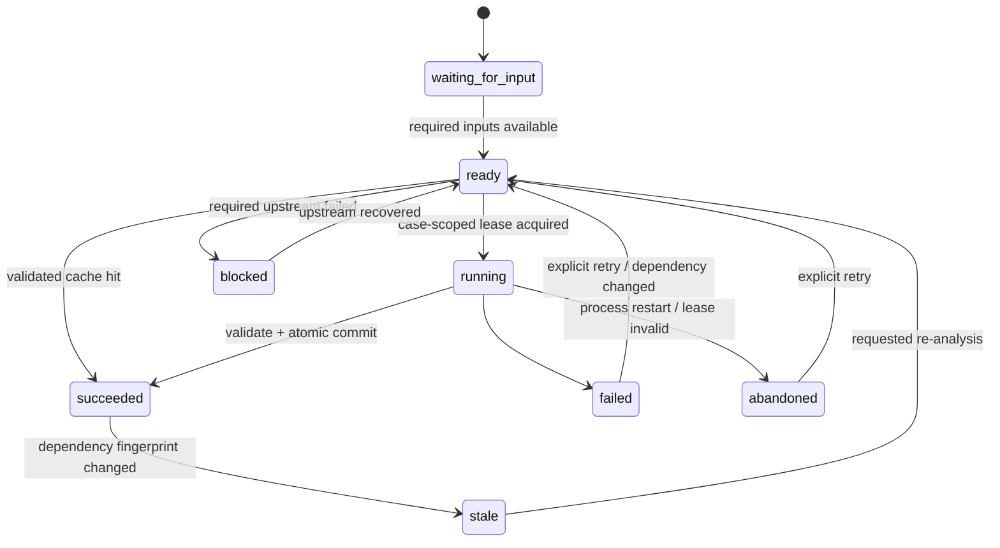
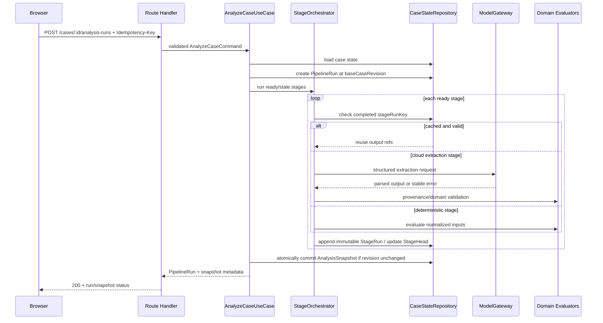
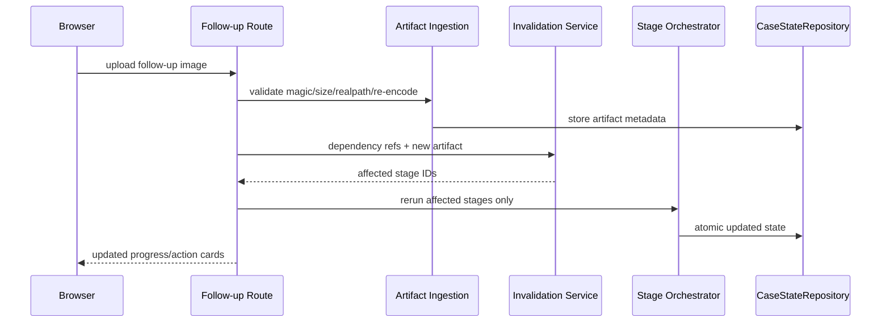
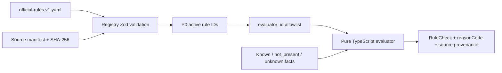
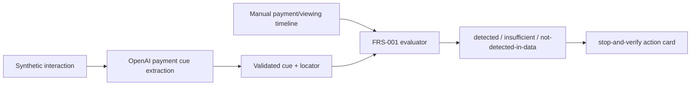
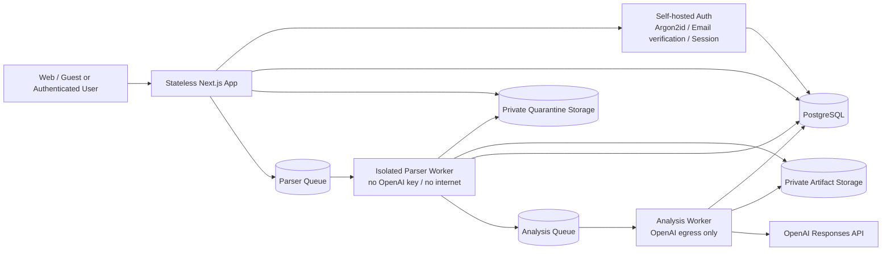

# RentProof 系統架構

- 狀態：P0 architecture baseline
- 版本：0.4
- 日期：2026-09-03
- 架構型態：Next.js／TypeScript 模組化單體
- P0 執行環境：本機 Node.js process、synthetic-only

本文件是系統邊界、模組、依賴方向、分析流程、儲存、API、部署與失敗模式的架構來源。Server profile／listener／HTTP LAN／Production HTTPS 的 canonical contract 見 [Server 配置](SERVER_CONFIGURATION.md)；詳細 domain schema／演算法見 [技術設計](TECHNICAL_DESIGN.md)，前端與 RWD 見 [UI 設計](UI_DESIGN.md)，OpenAI 呼叫契約見 [OpenAI 整合](OPENAI_INTEGRATION.md)，安全 Gate 見 [安全與隱私規格](SECURITY_PRIVACY.md)，真實資料版的 guest／account contract 見 [選用帳戶、登入與歷史租約架構](AUTH_AND_HISTORY.md)。

## 1. 架構目標

1. 每個結果都能回到廣告、照片、契約頁碼、互動原文或官方來源。
2. OpenAI 只處理非結構化抽取；分類、金額、規則、風險訊號與報告由本機程式決定。
3. 每個分析 stage 可重跑、快取、失敗、局部失效，不必重跑整案。
4. P0 保持單人可實作，不導入 ORM、queue、微服務或自治 Agent swarm。
5. Demo truth、fallback、runtime data 與 repository 清楚分離。
6. 未知與錯誤安全失敗，不能被顯示為「沒有問題」。
7. P1 可替換儲存與執行器，而不改 domain contract。
8. 真實資料版維持單一入口；guest 與 user 共用 evidence pipeline，但 authorization、history 與 retention 不同。

## 2. P0 約束與非目標

- 一個 synthetic Golden case。
- 12 張看屋照片、清楚文字 PDF、廣告、補拍與 synthetic interaction。
- 6 個 P0 official-rule evaluators 與 `FRS-001`。
- 一個 Node process；不支援多 instance／水平擴展。
- 本機 filesystem＋JSON state；不使用 SQLite／PostgreSQL／object storage。
- 不使用 OpenAI Conversations、Assistants、File Search、Web Search、background mode、MCP 或 tools。
- 不接受真實租約、真實影像、身分文件或銀行資料。
- 不公開部署；P0 預設只綁定 loopback，另允許明確的 `lan_development` HTTP profile 供私人區域網路測試。

## 3. 核心架構決策

| 項目          | P0 決策                                                     | 理由                                                             |
| ------------- | ----------------------------------------------------------- | ---------------------------------------------------------------- |
| 架構          | 模組化單體                                                  | 單一 schema／transaction 邊界，降低協調成本                      |
| Runtime       | Next.js Node runtime                                        | 需要 server-only SDK、PDF 與 filesystem；不使用 Edge             |
| UI            | App Router conversation-first shell＋四區Evidence Workspace | 對話引導操作；四區維持snapshot／locator完整性，不做自治聊天Agent |
| API           | Next.js Route Handlers＋Zod                                 | request／response contract 可測且 server-only                    |
| Domain        | 純 TypeScript functions／schemas                            | 可在無 OpenAI、無 filesystem 下單測                              |
| Orchestration | 顯式 Stage DAG                                              | 可追蹤、快取、局部重跑；不採自治 Agent                           |
| State         | `CaseStateRepository`＋JSON adapter                         | P0 簡單；P1 可換 database adapter                                |
| Artifacts     | 私有 filesystem adapter                                     | 不進 `public/`，以 opaque storage key 存取                       |
| LLM           | OpenAI Responses：Luna conversation／Terra evidence         | 高頻文字與高風險跨模態分流；Structured Outputs、server-only      |
| Rules         | allowlisted TypeScript evaluators                           | 不執行 YAML 自由文字                                             |
| Report        | reason-code templates                                       | 不讓 LLM生成法律／責任結論                                       |
| Demo fallback | 明確 Fixture mode                                           | Live failure 不得偷偷 fallback                                   |

Conversation輸入以free text為主，但只進入`ConversationIntentExtractor`port；它輸出allowlisted typed candidates，不取得tools或stage executor。Application依candidate impact決定直接回read-only projection、要求澄清或等待user confirmation，只有confirmed command可呼叫既有use case。

## 4. System Context



`VERIFY` 不是 API integration。P0 只顯示官方查證建議，不自動報案、撥號或查詢警政／銀行資料。

## 5. P0 Deployment

### 5.1 Deployment profiles

| Profile                | Network／data                            | OpenAI                                       | Storage／write policy                                                                                |
| ---------------------- | ---------------------------------------- | -------------------------------------------- | ---------------------------------------------------------------------------------------------------- |
| `local_development`    | HTTP loopback、synthetic                 | 由 `RENTPROOF_LLM_MODE` 明確選 Fixture／Live | Demo read-only＋runtime writable；無 production auth                                                 |
| `lan_development`      | HTTP、明確私人 LAN IP、synthetic-only    | Fixture 預設；Live 需顯式啟用與成本限制      | Demo read-only＋runtime writable；無 auth／真實資料                                                  |
| `public_http_showcase` | 未來profile；D-046期間disabled／不可部署 | 停用；無runtime／key／API                    | 若未來啟用才產生static fixture；目前無Build產物                                                      |
| `production`           | 單一入口；guest 或登入後真實案件         | worker-only live                             | App＋local-only PostgreSQL同一Server；off-host private object／backup storage＋queue；guest短期purge |

Profile在process startup或static build固定，不能由request／query／UI切換。`production`永遠不允許Fixture mode；`public_http_showcase`永遠不含Node runtime、OpenAI key、API／upload／auth／Cookie。

P0 `local_development`／`lan_development`固定在目前Windows桌面電腦驗證。Production OS尚未決定，P0程式不得依賴Windows Server或Linux專用service／path；Domain與Application保持平台中立。

`lan_development` 的啟動條件：

- `NODE_ENV`可為`development`或`production`，但`RENTPROOF_ALLOW_REAL_DATA=false`，auth／password-reset／history routes不註冊。日常測試用Dev Server；正式Demo用Production Build。`NODE_ENV=production`不得提升deployment capability。
- `RENTPROOF_BIND_HOST` 必須是本機實際擁有的單一 RFC1918 private address；拒絕 `0.0.0.0`、`::`、public address 與 wildcard hostname。
- `RENTPROOF_PUBLIC_ORIGIN` 是產生絕對 URL 的唯一 canonical origin；LAN 必須是完整 `http://private-ip:port`。`RENTPROOF_ALLOWED_HOSTS`／`RENTPROOF_ALLOWED_ORIGINS` 使用精確值；拒絕 `*`、`null` 與非 allowlisted Host／Origin。
- OS firewall只在Windows Private network profile對整個可達網路開放RentProof指定LAN IP／TCP port；Public／Domain profiles禁止。Router禁止port forwarding／UPnP exposure。
- Browser 與 server 間沒有 TLS，因此此 profile 永遠不能處理真實租約、帳戶憑證、Email／SMS OTP、production session 或其他秘密。
- Fixture 是 LAN 預設。若明確切換 Live，OpenAI key 仍留在 server，且需 request／case rate limit、並行限制與 OpenAI Project spend limit；輸入仍只能是 synthetic。
- LAN ingest 只接受外部 Demo manifest 中 `synthetic: true` 且 MIME／bytes／SHA-256 相符的 artifact；其餘回 `DEV_SYNTHETIC_ARTIFACT_NOT_ALLOWLISTED`，不保存、不送 OpenAI。
- `authEnabled`、`secureCookies`、`uploadsEnabled`、`readOnly`、`requireHttps` 等安全能力由 deployment profile 的 discriminated union 衍生，不提供獨立環境 boolean 任意降級。非 production 若設定 `RENTPROOF_ALLOW_REAL_DATA=true` 必須拒絕啟動。

若後續只需要本機持久化，可為 `local_development`／`lan_development` 加 SQLite repository adapter；這不是 public deployment topology，production 仍使用 PostgreSQL。



P0 不部署到 serverless／Edge：local JSON、external Demo directory、private runtime directory 與單 process lock 都依賴長生命週期 Node process。`lan_development` 只是同一開發 process 的受限 bind mode，不是 public deployment 或 production substitute。

Windows P0 runtime未覆寫時解析為`%LOCALAPPDATA%\RentProof\runtime`，並分離`quarantine`／`artifacts`／`state`／`cache`。Resolver拒絕repository、Demo、public、Documents／OneDrive、UNC／network、removable及reparse paths；不得fallback到`%TEMP%`或cwd。

Windows P0 Demo root未覆寫時解析為`%USERPROFILE%\RentProof-Demo`。目錄由使用者／素材流程預先準備，App read-only且不得建立、寫入、初始化Git或從repository複製；不存在時明確`DEMO_DIR_MISSING`。

Demo root使用immutable `cases/golden-vN/`版本。每版manifest列出所有素材、truth與fallback的relative path／kind／MIME／bytes／SHA-256／provenance，另以sidecar封存manifest hash；App只載入顯式版本並拒絕missing／extra／mismatch，不解析`latest` alias。Truth與fallback保持不同trust domain。

Active case只由符合`^golden-v[1-9][0-9]*$`的`RENTPROOF_DEMO_CASE_VERSION`選擇；不得掃描目錄、猜測最新版或接受path。Version與manifest hash進snapshot／report metadata，absolute filesystem path不進UI／report／log。

Manifest contract為`rentproof.demo-manifest.v1` strict JSON：`manifest.sha256`先驗exact raw UTF-8 bytes，再parse成unknown通過Zod／JSON Schema。最大1 MiB／100 entries，path以Windows case-insensitive語意檢查collision及absolute／UNC／drive／traversal／reserved-name，最後逐檔realpath containment與hash驗證。

每個runtime run是validated root下的app-owned child。Development依manifest最後寫入時間保留7天；Formal Demo使用獨立run並於停止清除，crash後在下一次Demo preflight清除abandoned run。Cleanup lock與active-run marker避免刪除正在使用的state，且每次刪除前重新做D-067 path／ownership驗證。

## 6. Layer 與依賴方向



依賴規則：

- `domain` 不 import Next.js、OpenAI SDK、Node filesystem 或 YAML parser。
- `application` 不直接 import OpenAI SDK／filesystem；只依賴 ports。
- `infrastructure` 實作 ports，可依賴官方 SDK 與 Node APIs。
- `app` 只做 transport、view-model mapping 與 use-case composition，不包含判定邏輯。
- Composition root 是唯一建立 concrete adapters 的地方。
- Server Components為預設；conversation composer／focus、workspace tabs、dialog、upload／follow-up progress等互動使用Client Components。
- Presentation 只接收 snapshot-bound view models；client 不接觸 domain evaluators、repository、private storage key 或 provider response。

## 7. 建議目錄結構

```text
src/
  app/                              # Next.js inbound adapter
    cases/[caseId]/page.tsx
    cases/[caseId]/workspace/...
    api/cases/...
  server/
    composition-root.ts             # 唯一組裝 modules + adapters
    env.ts                           # server-only config
  modules/
    shared-kernel/
    casework/
    conversation/
    ingestion/
    evidence-graph/
    listing/
    viewing/
    field-evidence/
    contract/
    fraud-facts/
    comparison/
    costs/
    official-rules/
    fraud-signals/
    analysis/
    reporting/
  ports/
    model-gateway.ts
    case-state-repository.ts
    artifact-store.ts
    pdf-text-extractor.ts
    rule-registry.ts
  adapters/
    openai/openai-responses-gateway.ts
    fixture/fixture-model-gateway.ts
    persistence/json-runtime/
    storage/private-filesystem/
    demo/external-demo-source/
    documents/text-pdf/
    rules/yaml-registry/
  config/
    analysis-profiles.ts
    security-policy.ts
    limits.ts
tests/
  integration/
  e2e/
```

每個 module 只透過 `index.ts`／`public.ts` 暴露 contract；禁止跨 module deep import。`analysis` 可協調 feature use cases，feature modules 不反向依賴 `analysis`。Demo 素材仍在 repository 外，不建立 `fixtures/` 複本。

## 8. 模組責任

| 模組         | 輸入                                   | 輸出                                          | 禁止事項                     |
| ------------ | -------------------------------------- | --------------------------------------------- | ---------------------------- |
| Case         | 使用者／Demo profile                   | `CaseState` shell                             | 法律或模型判定               |
| Artifact     | upload／external storage ref           | validated artifact metadata                   | 公開 URL、使用者路徑         |
| Listing      | 廣告圖片／文字                         | `Claim[]` candidates                          | 判定承諾真假                 |
| Viewing      | validated claims                       | 拍攝／詢問 checklist                          | 額外 LLM call                |
| Evidence     | 看屋照片                               | `Observation[]`                               | 未拍到＝不存在、漏水診斷     |
| Contract     | local PDF page text                    | `ContractClause[]`                            | 法律結論                     |
| Comparison   | claims＋observations＋clauses          | `claim_comparison` findings                   | 模型自由分類                 |
| Costs        | normalized fees＋optional usage        | 固定月費、變動公式、一次性費用                | 無用量時虛構完整月總額       |
| Rule         | contract facts＋case profile＋registry | `RuleCheck[]`                                 | `eval` YAML、合法／違法      |
| Fraud Signal | interaction cue＋人工 timeline         | `FraudSignalCheck[]`                          | 詐騙 verdict／機率／黑名單   |
| Follow-up    | finding＋新 artifact                   | dependency invalidation                       | 全案無條件重跑               |
| Report       | findings＋checks＋signals              | action-card view model                        | 新事實、自由排序、責任結論   |
| Analysis     | inputs＋versions                       | `PipelineRun`＋`StageRun`＋`AnalysisSnapshot` | 隱性 fallback、混合世代 view |

## 9. Ports 與 Adapters

### 9.1 Required ports

```ts
interface CaseStateRepository {
  load(caseId: string): Promise<CaseState | null>;
  saveAtomic(state: CaseState, expectedRevision: number): Promise<void>;
}

interface ArtifactStore {
  put(input: ValidatedArtifactInput): Promise<StoredArtifact>;
  read(storageKey: string): Promise<Uint8Array>;
  remove(storageKey: string): Promise<void>;
}

interface ModelStageMap {
  "listing.extract": { input: ListingModelInput; output: ListingCandidateOutput };
  "evidence.extract": { input: EvidenceBatchInput; output: EvidenceCandidateOutput };
  "contract.extract": { input: ContractTextInput; output: ContractCandidateOutput };
  "interaction.extract": { input: InteractionInput; output: PaymentCueOutput };
}

interface ModelGateway {
  extract<S extends keyof ModelStageMap>(request: ModelRequest<S>): Promise<ModelResult<S>>;
}

interface PdfTextExtractor {
  extractPages(storageKey: string): Promise<PdfPageText[]>;
}

interface RuleRegistry {
  loadProfile(profile: "p0" | "p1"): Promise<ValidatedRuleSet>;
}
```

### 9.2 Production identity／policy ports

Golden P0不依賴下列ports；其中self-hosted account Auth與owner-scoped history已由Demo-safe、feature-gated切片實作並在loopback synthetic環境驗證，guest lifecycle與完整Production policy／storage／purge仍由first real-data release透過同一composition root注入：

```ts
type ActorContext =
  | { kind: "guest"; guestId: string; guestSessionId: string }
  | { kind: "user"; userId: string; sessionId: string };

interface ActorSessionPort {
  resolve(request: Request): Promise<ActorContext | null>;
  createGuest(): Promise<ActorContext & { kind: "guest" }>;
  revoke(actor: ActorContext): Promise<void>;
}

interface AuthProvider {
  register(input: RegistrationInput): Promise<RegistrationResult>;
  login(input: LoginInput): Promise<LoginResult>;
  logout(sessionId: string): Promise<void>;
  requestPasswordReset(input: { identifier: string; channel: "email" }): Promise<void>;
  verifyPasswordReset(input: PasswordResetChallenge): Promise<VerifiedReset>;
  setNewPassword(input: VerifiedReset & { newPassword: string }): Promise<void>;
}

interface PolicyRegistry {
  loadPublished(type: PolicyType, locale: string): Promise<PolicyDocument>;
  appendEvent(actor: ActorContext, event: PolicyEventInput): Promise<void>;
  setConsentPreference(actor: ActorContext, preference: ConsentPreferenceInput): Promise<void>;
}
```

D-089後Auth adapter改為RentProof self-hosted：只有infrastructure password adapter可import鎖版`argon2`，只有database adapter可importKysely／node-postgres。Email identity與opaque account session經Application ports投影成`ActorContext`；RentProof repository仍執行owner relationship authorization，不能以Client可見性、Email或opaque case ID取代。

- Presentation 只能把 server 解析出的 `ActorContext` 交給 application；request body 不接受 `userId`、`guestId` 或 owner 欄位。
- Production repositories 以 user／guest owner scope query；guest 沒有 list／search history 能力。
- Guest-to-user transfer 同時驗證兩個 sessions，採 transaction 原子換 owner，成功後撤銷舊 guest access。
- Email驗證／recovery由self-hosted Auth application service協調受控Email delivery adapter；密碼、verification／reset code與session token不進domain case state、OpenAI payload或logs。SMS／phone route不在初期範圍。
- Account session由RentProof以256-bit opaque HttpOnly Cookie＋PostgreSQL keyed digest管理。合格主動使用以原子update延長7天idle expiry並刷新Cookie；passive session status、prefetch、polling、靜態資源與失敗request不延長。Guest仍採獨立固定24小時policy。
- `PolicyRegistry` 分開記錄 Terms acceptance、Privacy acknowledgement、Cloud Processing consent；Cookie 依 purpose key 另記 granted／declined／withdrawn preference。

### 9.3 P0 adapter mapping

| Port                  | Live mode                                   | Fixture mode                                     |
| --------------------- | ------------------------------------------- | ------------------------------------------------ |
| `ModelGateway`        | `OpenAIResponsesGateway`                    | `FixtureModelGateway`                            |
| `CaseStateRepository` | JSON runtime adapter                        | JSON runtime adapter                             |
| `ArtifactStore`       | private filesystem                          | external Demo read-only＋private follow-up store |
| `PdfTextExtractor`    | Mozilla PDF.js／`pdfjs-dist` server adapter | same                                             |
| `RuleRegistry`        | versioned YAML＋snapshots                   | same                                             |

Mode 在 process startup 固定；一個 case 執行中不得切換。Live failure 只回 failure，操作者需重啟／明確改 Fixture mode。

`ModelResult` 必須建模執行來源：Live 為 `executionMode: "live", provider: "openai"`；Fixture 為 `executionMode: "fixture", provider: "fixture"`，並另存 `recordedFrom` 的 OpenAI model／parameters／snapshot hash。Fixture 不得偽裝成本次 OpenAI request。

## 10. Data Architecture

### 10.1 CaseState aggregate

```ts
type CaseState = {
  schemaVersion: string;
  revision: number;
  case: RentalCase;
  profile: CaseApplicabilityProfile;
  artifacts: Artifact[];
  userAssertions: UserAssertion[];
  followUps: FollowUpRequest[];
  pipelineRuns: PipelineRun[];
  stageRuns: StageRun[];
  stageHeads: Record<string, string>;
  analysisSnapshots: AnalysisSnapshot[];
  activeSnapshotId?: string;
};
```

Claims、observations、clauses、findings、rule checks、fraud signals 與 report 不作 root-level mutable fields；它們存在不可變 `StageResult`／`AnalysisSnapshot` 中，避免 snapshot 與「latest arrays」形成兩套真相。

執行物件分工：

| 物件               | 責任                                                                                                                                    |
| ------------------ | --------------------------------------------------------------------------------------------------------------------------------------- |
| `PipelineRun`      | 一次 full／target-scoped command、base case revision、execution mode、整體狀態與 stage IDs                                              |
| `StageRun`         | 單一 DAG node 的不可變 run：key、hash、attempt、provider provenance、error、output hash                                                 |
| `StageResult`      | 通過 schema、locator、same-case validation 的不可變輸出                                                                                 |
| `StageHead`        | 每個 execution mode＋stage＋scope 指向目前有效成功 run；Live／Fixture namespace 永久分離                                                |
| `AnalysisSnapshot` | 在同一case revision／execution mode下供conversation result cards與四區workspace一致讀取的claims、findings、checks、signals、report refs |

分析開始時鎖定 `baseCaseRevision`。所有必要 stage 結果驗證完成後，才原子建立 `AnalysisSnapshot` 並切換 `activeSnapshotId`；執行期間若 case revision 改變，results 可留在 case-scoped cache，但 snapshot commit 必須回 `CASE_REVISION_CHANGED`，不能組成混合世代報告。

JSON adapter 以 `revision` 做 optimistic check，以 temp file＋atomic rename 寫入。P0 每個 case 使用 in-process mutex，避免同一 case 同時分析／補件造成 lost update。Process restart 時殘留 `running` run 轉成 `abandoned`／`interrupted`，不得視為成功。

### 10.2 Runtime layout

```text
RENTPROOF_RUNTIME_DIR/
  cases/{caseId}/state.json
  artifacts/{artifactId}/{opaqueFilename}
  uploads/{uploadId}/{temporaryFilename}
```

- `storageKey` 是 opaque ID，不是 absolute path。
- 每次 realpath 後確認仍位於 runtime root。
- artifact metadata 保存 SHA-256、MIME、bytes、preprocess hash；不保存 public URL。
- temporary upload 通過驗證與 re-encode 後才移入 artifacts。

Artifact lifecycle：

```text
received → quarantined → validated → normalized → available → deleted
                     ↘ rejected
```

- P0 外部 synthetic 原檔唯讀；runtime 只保存驗證／重編碼後 derivative。
- `ArtifactLineage` 記錄 source artifact hash、derivative hash、preprocess／redaction version、頁碼／crop 與 bytes。
- OpenAI 只收到 derivative、必要頁面、必要 crop 或帶頁碼的最小文字。
- 未驗證 PDF 不 inline 顯示；preview 使用 rasterized／sanitized derivative。
- P1 原始 evidence 與 derivative 分開保存，各自受 private authorization／retention 管理。

### 10.3 Demo layout

```text
RENTPROOF_DEMO_DIR/
  listing/
  viewing/
  contract/
  interaction/
  follow-up/
  truth/manifest.json
  truth/assertions.json
  fallback/analysis.json
```

`truth` 是人工 assertion；`fallback` 是模型快照。Fixture loader 必須比對 manifest／input hashes、model、reasoning、image detail、prompt／schema／ruleset versions，任何不符即 fail closed。

三個 ports 必須分開：

- `DemoFixtureSource`：runtime 可唯讀素材 manifest／artifacts。
- `FixtureAnalysisSource`：Fixture mode 可唯讀 fallback stage-result bundle。
- `GoldenTruthSource`：只在 tests／eval composition root 綁定；runtime、UI、report composer 禁止 import／讀取 assertions。

App 永遠不寫入 `RENTPROOF_DEMO_DIR`。外部 Demo manifest 可與素材一起被竄改，因此正式 Golden release 需在 repository 的 release config 固定 `datasetId`／manifest root digest；未固定前只視為本機開發資料，不作可信來源證明。

### 10.4 Repository source data

```text
rules/
  official-rules.v1.yaml
  snapshots/2026-09-01/
    manifest.json
    *.html
    *.pdf
```

Ruleset 仍為 draft，直到 TypeScript evaluators 與 regression 完成；已有 snapshot hash 不等同已完成法律審查。

## 11. Analysis Stage DAG



每個方塊都是明確 stage；不存在模型自選下一步。Orchestrator 只執行 dependency 已完成且 output schema 有效的 stage。

- Evidence extraction 使用固定 observation taxonomy，避免廣告變更迫使 12 張照片重新送 OpenAI。
- 照片排序與 batch plan 固定，其 hash 納入 stage key。
- P0依DAG執行，provider concurrency hard cap為2；只有彼此無dependency且case budget已原子reserve的cloud stages可並行，不能因圖上可平行無界增加。
- P0 follow-up 只允許牆面變色 target-scoped 子圖；不回到全域 Evidence／Comparison。

## 12. Stage State Machine



Stage output fields：

- `stageRunId`
- `stage`
- `status`
- `stageRunKey`
- `dependencyHash`
- `input／preprocess hashes`
- `prompt／schema／ruleset versions`
- `requested／resolved model`、reasoning、image detail
- provider request ID、usage、attempt count
- error／reason code
- output refs

`stageRunKey` 相同且先前 output 已成功／驗證時直接重用。`running` key 不重送；timeout 後先標記不確定，不能假設 provider 未處理。新 run 在完整驗證前不覆寫 `StageHead`，因此失敗時仍可保留舊 snapshot，但 UI 必須標示 stale／最新重跑失敗。

`missing_information`、`insufficient_evidence` 是成功的 domain 結果；refusal、schema invalid、locator invalid、auth、rate limit 才是 stage failure。

### 12.1 Idempotency and cache

```text
directInputHash = H(canonical direct inputs)
dependencyHash  = H(sorted upstream semantic output hashes)
configHash      = H(stageId + algorithmVersion + relevant model/prompt/schema/preprocess/rules config)
stageRunKey     = H(caseId + executionMode + stageScope + directInputHash + dependencyHash + configHash)
```

| 層級            | Key／guard                                | 行為                                                    |
| --------------- | ----------------------------------------- | ------------------------------------------------------- |
| API command     | `Idempotency-Key`＋case＋route＋body hash | 同 key／同 body 重播；同 key／不同 body 回 conflict     |
| Artifact        | canonical SHA-256＋kind／role             | 相同素材不重存、不重觸發                                |
| Stage           | `stageRunKey`                             | succeeded 重用；running 回既有 run；failed 可新 attempt |
| Snapshot commit | `expectedCaseRevision`                    | 防止分析結果覆蓋已更新 case                             |

- Canonical JSON 固定欄位排序；output hash 排除 request ID、usage、時間戳，但保留影響判斷的 quality flags。
- Cache 永遠 case／tenant scoped；禁止跨案件以內容 hash 共用，避免形成內容存在性 oracle。
- Live／fixture 使用不同 namespace，絕不共用 stage result。
- Downstream 依賴 upstream semantic output hash，不依賴隨機 run ID。
- 只有完整驗證的 success 可 cache；error 不得冒充 success cache。

## 13. Dependency Invalidation

| 變更                            | 標為 stale                                                               | 不重跑                                                      |
| ------------------------------- | ------------------------------------------------------------------------ | ----------------------------------------------------------- |
| 廣告                            | listing、viewing checklist、comparison、costs、report                    | evidence、contract extraction                               |
| 某批看屋照片                    | 該 evidence batch、merge、comparison、observation follow-up、report      | listing、contract、rules、fraud signal                      |
| 契約                            | contract PDF/text、contract extraction、comparison、costs、rules、report | listing、evidence、fraud signal                             |
| Case applicability profile      | affected rules、report                                                   | listing／evidence／contract extraction                      |
| Interaction text                | interaction extraction、FRS-001、report                                  | claim comparison、official rules                            |
| Manual payment/viewing timeline | FRS-001、report                                                          | OpenAI interaction extraction                               |
| Rule YAML／snapshot／profile    | rule checks、report                                                      | OpenAI extraction                                           |
| Fraud evaluator／catalog        | fraud signal、report                                                     | claim comparison、official rules、OpenAI evidence／contract |
| Report template                 | report only                                                              | 全部 analysis stages                                        |
| Prompt／schema／model config    | only matching cloud stages＋downstream                                   | unrelated stages                                            |
| 牆面補拍                        | related observation follow-up、report                                    | unrelated claims／rules／fraud signal                       |

Follow-up 以 dependency refs 決定局部失效；P0 不做泛用事件溯源。Finding 使用穩定 logical key（例如 `findingType + subjectKey`），補件不應改變無關 finding ID／stage run。

## 14. Main Analysis Sequence



P0 foreground runner 在 request 內執行，不回 `202 Accepted` 暗示 durable background work。相同 key 已在執行時回既有 run；GET run status 供斷線恢復／另一 request 查詢。P1 queue／worker 才採真正非同步 `202`。

## 15. Follow-up Sequence



## 16. API Architecture

### 16.1 Transport rules

- Route handler 只做 actor context（production）、Zod parse、use-case call、error mapping。
- Request 不接受 filesystem path、OpenAI key、model ID、base URL 或 rule evaluator ID。
- Response 使用 view model，不直接序列化 `CaseState`。
- 所有 error 使用 stable `code`，不回 provider body／stack／private path。
- Mutating request 帶 `clientRequestId`；server 另產 `stageRunId`。
- Create／analysis mutation 接受 `Idempotency-Key`；profile／timeline mutation 使用 expected revision／`If-Match`，衝突回 409。

### 16.2 P0 routes

| Method  | Route                                               | Use case                                                                        |
| ------- | --------------------------------------------------- | ------------------------------------------------------------------------------- |
| `POST`  | `/api/cases`                                        | CreateCase                                                                      |
| `PATCH` | `/api/cases/:caseId/profile`                        | UpdateCaseProfile with expected revision                                        |
| `POST`  | `/api/cases/:caseId/artifacts`                      | AddArtifact                                                                     |
| `POST`  | `/api/cases/:caseId/interactions`                   | AddSyntheticInteraction                                                         |
| `PUT`   | `/api/cases/:caseId/fraud-timeline`                 | Set manual payment／viewing timeline; unknown is explicit                       |
| `POST`  | `/api/cases/:caseId/analysis-runs`                  | Run foreground full／allowlisted target analysis                                |
| `GET`   | `/api/cases/:caseId/analysis-runs/:runId`           | Get run-specific status                                                         |
| `GET`   | `/api/cases/:caseId/summary`                        | GetSummaryView                                                                  |
| `GET`   | `/api/cases/:caseId/matrix`                         | GetEvidenceMatrixView                                                           |
| `GET`   | `/api/cases/:caseId/contract-review`                | GetContractReviewView                                                           |
| `GET`   | `/api/cases/:caseId/fraud-signals`                  | GetFraudSignalView                                                              |
| `GET`   | `/api/cases/:caseId/report`                         | GetReportView                                                                   |
| `POST`  | `/api/cases/:caseId/findings/:findingId/follow-ups` | Add case-scoped follow-up                                                       |
| `GET`   | `/api/cases/:caseId/artifacts/:artifactId/content`  | P0 驗證 case association 後串流 sanitized preview；P1 再加 tenant authorization |

`DELETE /cases`、authentication 與多案件授權屬真實資料／P1 Gate；在 API 文件中不得假裝 P0 已完成。

Production 保留相同 case routes，但每個 request 都必須帶 server-resolved guest／user `ActorContext`。另增加單一 `/auth` flow、Email／SMS password reset、authenticated history list、policy events 與 guest-to-user transfer；guest 存取 `/api/cases` list 回 `AUTH_REQUIRED_FOR_HISTORY`，不能回其他使用者資料或用 case ID 作恢復。

Conversation result與四區workspace view response必須帶相同`snapshotId`；UI在follow-up新snapshot完成前不混讀stage heads。

```ts
type ResponseMeta = {
  caseRevision: number;
  snapshotId?: string;
  snapshotHash?: string;
  executionMode: "live" | "fixture";
  analysisStatus: string;
};
```

所有敏感 view 使用 `Cache-Control: private, no-store`，不得寫入 localStorage／IndexedDB／CDN cache。

### 16.3 Error envelope

```ts
type ApiError = {
  error: {
    code: string;
    message: string;
    stage?: string;
    retryable: boolean;
    clientRequestId?: string;
  };
};
```

UI 依 `code` 顯示中立狀態；provider refusal／incomplete／schema error 不得轉成空 results。

## 17. OpenAI Architecture

### 17.1 Cloud stages

| Stage                 | Input                            | Structured output      | Local post-validation                        |
| --------------------- | -------------------------------- | ---------------------- | -------------------------------------------- |
| `listing.extract`     | listing image/text               | claim candidates       | artifact／locator、normalization eligibility |
| `evidence.extract`    | small image batch                | observation candidates | artifact IDs、bbox、coverage flags           |
| `contract.extract`    | local page-numbered text         | clause candidates      | page/excerpt lookup、semantic-key allowlist  |
| `interaction.extract` | synthetic interaction text/image | payment-request cue    | locator；timeline is manual, not LLM-derived |

### 17.2 Gateway rules

- Official TypeScript SDK／Responses API／Structured Outputs。
- P0 route allowlist：Conversation=`gpt-5.6-luna`／low；Evidence=`gpt-5.6-terra`／medium；不得自動cross-route fallback。
- Service tier allowlist：只允許明確`default`；requested／resolved tier進provenance與cache config hash。
- Evidence每case維持16 Terra attempts／concurrency 2／500K／50K與US$2 alert。Conversation每case用non-sliding 24h Luna window：200 attempts／concurrency 1／500K input／100K output＋reasoning、US$0.50 alert。兩者分離且reserve／usage reconciliation進transaction；Conversation超限保留Server-only UI，不切Terra。
- `store: false` hard-coded；foreground、stateless requests。
- `tools: []`；不使用 web/file search、Conversations、background 或 remote MCP。
- Canonical Zod schema；無 parsed output、refusal、incomplete 都是 stable failure。
- API key server-only；不允許 user-controlled model／base URL。
- SDK retry 只在 gateway 設定；application 不再疊加 retry。
- Usage／request IDs／model／parameters進 `StageRun`／`AnalysisSnapshot`，不記 prompt／原始文件。

OpenAI 官方 Responses API 支援 text、image、file inputs 與 JSON output；`store` 控制 response 是否供日後 retrieval，但不等同 ZDR。[Responses API](https://developers.openai.com/api/reference/cli/resources/responses/methods/create)、[Data controls](https://developers.openai.com/api/docs/guides/your-data)。

## 18. Official Rules Architecture



- YAML predicate text 是 documentation only，永不 `eval`。
- Registry 驗證唯一 rule ID、source refs、active profile、hash、effective date 與 evaluator mapping。
- Result precedence：有可定位疑似差異；否則資料完整才可 no-difference；其餘 missing-information。
- 6條P0 allowlisted evaluator與regression tests已完成；Ruleset仍維持draft是因規則內容尚未完成正式法律／治理審查，而不是缺少evaluator或測試。

## 19. Fraud Signal Architecture

P0 只實作 `FRS-001`：首次實地看屋前要求付款。



- OpenAI 不決定時間先後、詐騙 verdict 或 action。
- `paymentRequestedAt`／`firstInPersonViewingAt` 由 synthetic timeline／使用者確認。
- 任一時間 unknown → `insufficient_information`。
- Risk signal 不進 Claim matrix／OfficialRule engine，不合成分數。
- P1 `FRS-002` 至 `FRS-010` 仍使用獨立 guidance registry，不混入契約法規。

## 20. Report Architecture

Report composer 接受已驗證 domain results，只輸出 action-card view model：

```ts
type ActionCard = {
  actionId: string;
  actionType: "stop_and_verify" | "ask" | "reshoot" | "request_document" | "confirm_change";
  priority: number;
  target: string;
  suggestedQuestion: string;
  requiredEvidence: string[];
  reasonCode: string;
  evidenceRefs: EvidenceRef[];
  completionCriteria: string[];
  status: "open" | "partially_complete" | "complete";
};
```

Priority 是 reason-code mapping：`stop_and_verify` 最前，其次明確矛盾、官方規則疑似差異、證據不足。LLM 不參與排序或報告文案。

每個 `ReportSnapshot` 綁定單一 `analysisSnapshotId`、case revision、artifact lineage、ruleset／source hashes、model／prompt／schema versions 與 report hash。補件後建立新 report version，不覆蓋舊報告；P0 不做分享連結。

## 21. Security Architecture

### 21.1 Trust boundaries

1. Browser → Route Handler：全部 untrusted；Zod、guest／user session、CSRF／origin（公開版）、upload validation。
2. Route Handler → Application：只傳 normalized command，不傳 paths／keys。
3. Application → Infrastructure：經 ports；不讓 domain 控制 endpoint／filesystem。
4. RentProof → OpenAI：最小必要 synthetic content，server key，HTTPS。
5. Runtime／Demo filesystem：realpath root check，拒絕 symlink／junction escape。
6. Rule snapshots：read-only、manifest hash、registry validation。

### 21.2 P0 controls

- `local_development` 綁 loopback；`lan_development` 只綁明確 private LAN IP，並持續顯示 synthetic-only／HTTP／LAN banner。
- 驗證 Host／Origin；mutation route 使用 CSRF 防護，即使在 local profile 也不信任瀏覽器來源。
- LAN profile使用exact Host／Origin allowlist、不回wildcard CORS、拒絕public／wildcard bind；OS firewall限Windows Private profile及RentProof指定LAN IP／port，但D-065允許該Private網路中所有可達來源。
- LAN profile 不啟用 account／recovery／history routes，不建立 production guest／account session cookie；需要本機 case association 時只可使用 session-only、synthetic dev context。
- LAN Live mode 需顯式 opt-in、server-only key、request／cost cap；Fixture 為預設。無論模式都禁止真實資料。
- LAN artifact必須通過Demo manifest synthetic＋hash allowlist。D-076僅對Conversation text開放arbitrary input；文字仍是不受信任candidate source，不能繞過confirmation、owner／revision、typed evaluator或成為未驗證evidence。
- Response security headers：CSP（含 `connect-src 'self'`）、`nosniff`、frame protection、Referrer Policy、敏感內容 `Cache-Control: private, no-store`。
- Magic bytes、allowlisted MIME、bytes／pixels／pages limits、image re-encode／EXIF strip。
- PDF 不執行 JavaScript、attachments、form actions 或 external links。
- Interaction URLs inert：不 clickable／preview／fetch。
- HTML escaping、prompt-injection fixture、client-bundle secret scan。
- No logs with key、Authorization、prompt、raw contract、phone、account、OTP。
- Fallback provenance mismatch fail closed。
- Browser 不保存素材、findings、報告於 localStorage／IndexedDB；官方 registry URL 之外的使用者 URL 都是 inert text。
- HSTS與`Secure` production account cookie不適用純HTTP LAN dev／static HTTP showcase。LAN仍保留CSP／CSRF／Host／Origin／no-store；Showcase沒有mutation／Cookie並使用`connect-src 'none'`。這些HTTP例外不得流入`production`。

### 21.3 Before public/real data

- Guest／user actor sessions、per-case authorization、IDOR tests與 guest history denial。
- 單一入口的選用註冊／登入，以及 Email／SMS password reset、enumeration、OTP replay、session revocation tests。
- PostgreSQL＋private object storage、encryption、retention、deletion、backup policy。
- Guest 短期 retention／purge 與 session 遺失不可恢復告知。
- Versioned Terms、Privacy Notice、Cloud Processing Notice、Cookie preferences；三份公開政策完成法務／隱私審閱。
- OpenAI Project data controls、spend/rate limits、key rotation。
- SAST、dependency／secret scan、incident handling。

### 21.4 Production data lifecycle

- 每個 case／run 綁定 actor、Terms／Privacy／Cloud Processing 適用版本；非必要 Cookie preference 獨立保存，不進 analysis run。
- Raw evidence、sanitized derivative、cache、stage result、snapshot、report、object 與任何 OpenAI Files object 都有 lineage 與 delete scope。
- Case deletion 使用 cascade workflow 並保存 deletion audit；失敗項目可重試且不可回報已完成。
- Retention／purge job、backup policy 與備份刪除限制必須對使用者清楚說明。
- 完成 deletion E2E 前不接受真實資料。
- Public anonymous showcase 若先上線，必須 read-only、無 upload、無 key，不能只靠提示文字限制真實資料。

## 22. Observability

### 22.1 Structured events

- `case.created`
- `artifact.accepted`／`artifact.rejected`
- `stage.started`／`stage.completed`／`stage.failed`／`stage.reused`
- `openai.request.completed`／`openai.request.failed`
- `followup.applied`
- `report.composed`

### 22.2 Allowed fields

- case／artifact／stage IDs
- opaque／HMAC correlation IDs、versions、model、reasoning、image detail
- token usage、attempt count、duration、stable error code
- count／coverage metrics

禁止欄位：API key、Authorization、原始 prompt／response、完整租約、聊天、電話、帳號、OTP、private path、原始 content SHA。Raw hashes 只保留在受保護 case state。

P0 可輸出 JSON structured logs 至 console；正式服務使用可控 log sink 與 access policy。Metrics 至少涵蓋 schema／locator failure、file rejection、provider error、stale／abandoned run、刪除失敗與成本異常；P1 operational log 與 audit log 分離。

## 23. Failure Modes

| Failure                        | State                       | UI／行為                                        |
| ------------------------------ | --------------------------- | ----------------------------------------------- |
| Demo directory missing         | blocked／`DEMO_DIR_MISSING` | 顯示設定缺失，不生成資料                        |
| Upload rejected                | failed／stable code         | 顯示格式／限制，不保存原檔                      |
| PDF text unavailable           | blocked                     | 要求清楚文字 PDF；不啟用 OCR                    |
| OpenAI auth                    | failed／non-retryable       | 顯示設定錯誤，不露 provider body                |
| Rate／temporary server         | failed／retryable           | SDK bounded retry 後顯示失敗                    |
| Refusal／incomplete            | failed                      | 不產生空 findings                               |
| Schema／locator invalid        | failed                      | 不自由文字兜底                                  |
| Rule source／evaluator missing | blocked                     | ruleset draft／configuration error              |
| Timeline unknown               | completed with insufficient | FRS-001 顯示資料不足                            |
| Fallback hash mismatch         | failed closed               | 拒絕載入，要求重建 snapshot                     |
| Atomic save revision conflict  | retry use-case load／merge  | 不覆蓋較新 state                                |
| Process crash during stage     | `abandoned`／`interrupted`  | 不更新 StageHead／active snapshot；需明確 retry |
| Case changed during pipeline   | `CASE_REVISION_CHANGED`     | 保存可重用 stage cache，但拒絕混合世代 snapshot |

## 24. P1 Public Architecture

First real-data Production把App與PostgreSQL部署在同一台Server，但維持邏輯與權限邊界。下圖的APP／DB是不同process／service，不代表不同主機；DB只接受loopback／local socket。Private artifact／backup storage必須在不同故障域，不能只放同機磁碟。此拓撲不提供HA，Host故障會同時中斷App與DB。



P1 遷移界面：

- JSON repository → PostgreSQL repository。
- Filesystem artifact store → private object storage adapter。
- In-process orchestrator → queue／worker executor。
- Single-process mutex → database transaction／job uniqueness。
- Synthetic-only → guest／user authorization、retention、policy／consent Gate。
- 無帳戶 local flow → production single-entry guest session＋optional account／history。
- 同一 domain schemas、reason codes、stage DAG 與 report composer 保持不變。

## 25. 架構驗收條件

- Domain tests 可在沒有 Next.js、OpenAI、filesystem 下執行。
- PipelineRun／StageRun／AnalysisSnapshot／StageHead分離；conversation result cards與四區workspace固定讀同一snapshot。
- Fixture mode 不需要 key且不發 network；Live mode 不偷偷 fallback。
- 每個 cloud／deterministic stage 都有 input／output schema、stage key、dependency hash 與 stable errors。
- 任一 artifact／locator／evidence ref 都通過同 case 與範圍驗證。
- 修改一種 input 只使相依 stage stale。
- JSON state atomic write／revision conflict 有測試。
- Rule registry 不執行 YAML text，只有 allowlisted evaluator IDs。
- FRS-001 時間未知安全降級為 insufficient。
- Report 不生成新事實、詐騙 verdict、法律結論或責任歸屬。
- API key 不進 client bundle、state、fixture、report 或 log。
- P0 預設 loopback；`lan_development` 只允許明確 private IP＋HTTP＋synthetic data，拒絕 wildcard／public bind，Demo／runtime directories 位於 repository 外。
- Runtime composition 不可讀 Golden truth；Demo directory 永遠 read-only。
- `local_development`／`lan_development`／`public_http_showcase`／`production` profiles不可由request動態切換；Fixture／Live另由startup-only`RENTPROOF_LLM_MODE`決定。
- Public HTTP Showcase只有static fixture、無runtime／upload／API／OpenAI key／Cookie；Production不允許Fixture且必須HTTPS。
- LAN profile 的 auth routes 關閉、exact Host／Origin checks、Firewall／synthetic-only banner 與 Live cost limits具自動或操作清單驗收。
- 來源 snapshots 與 fallback provenance hash mismatch fail closed。
