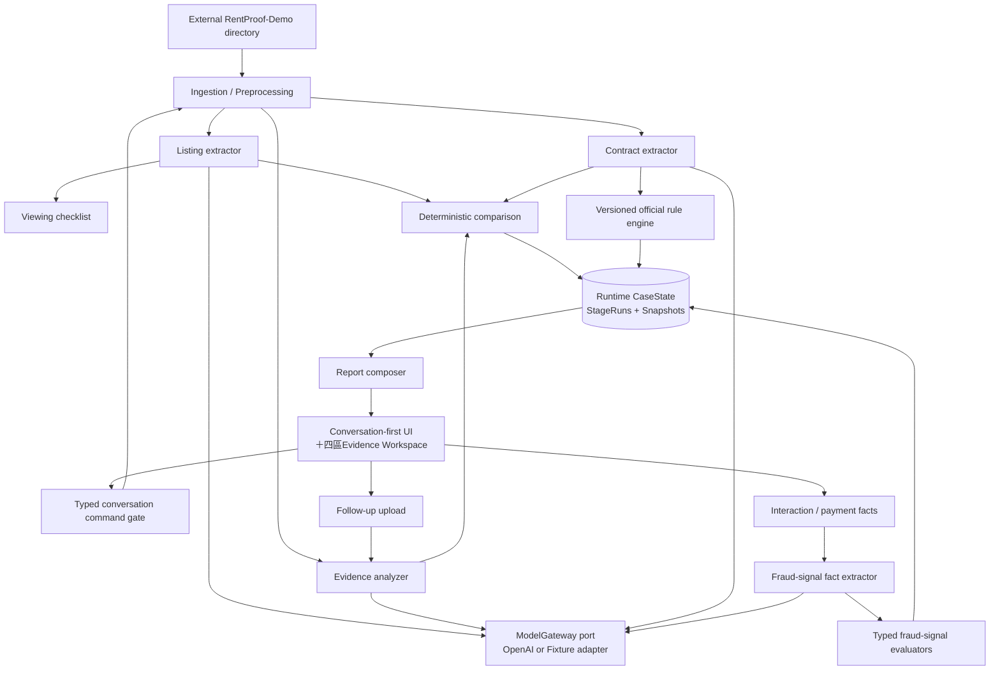

# RentProof 技術設計

- 狀態：MVP baseline
- 版本：0.4
- 日期：2026-09-02

系統上下文、layer／module、ports／adapters、stage DAG、state machine與失效矩陣以 [系統架構](SYSTEM_ARCHITECTURE.md) 為準；listener、本機HTTP、LAN HTTPS與Production HTTPS以 [Server 配置](SERVER_CONFIGURATION.md) 為準；guest／account、Email password reset、history與policy events以 [選用帳戶、登入與歷史租約架構](AUTH_AND_HISTORY.md) 為準。本文件保留domain schema、判定演算法與API細節。

## 1. 技術決策摘要

MVP採模組化單體Web App，讓conversation UI、workspace、上傳、分析、比較、規則與報告共用一個TypeScript domain model。Listing、Viewing、Evidence、Contract與Report仍是固定、可重跑的pipeline stage，不是各自部署或自由對話的Agent；conversation只是受控application projection／command入口。

建議技術棧：

- pnpm 目為唯一 package manager；Scaffold 時鎖定 `packageManager` 版本並提交 `pnpm-lock.yaml`
- Node.js 24 LTS；Scaffold 時鎖定當時最新 `24.x` patch，開發／CI／Production 使用同一 major／patch
- Next.js 16 Active LTS App Router＋TypeScript；Scaffold 時鎖定最新 patched `16.x`
- Tailwind CSS 目 design-token／layout styling 基礎
- shadcn/ui＋Radix Primitives 目 UI component baseline；只加入必要官方元件，生成 source 進 repository 並套用 RentProof design tokens
- ESLint Flat Config＋Next.js／TypeScript／React rules目code-quality Gate；Prettier目獨立formatter
- TypeScript增強嚴格模式：`strict`＋unchecked index／exact optional／return／switch／override／side-effect import checks，`noEmit`
- TypeScript 6.0穩定線；Scaffold時鎖定最新`6.0.x`與相容的typescript-eslint／React／Node types
- Mozilla PDF.js（`pdfjs-dist`）目目前文字型PDF逐頁抽取與安全預覽基礎，封裝於`PdfTextExtractor` adapter
- Sharp目目前JPEG／PNG server-side decode、auto-orient、resize、metadata stripping與sanitized derivative encoder
- Mobile-first RWD、極簡主義、正文／表格至少 16 px、caption 至少 14 px；完整規格見 `UI_DESIGN.md`
- Golden流程保留typed記憶體／外部JSON adapter；私有素材流程已使用Kysely＋node-postgres的PostgreSQL adapter與加密private storage
- Zod 目為 API、LLM Structured Outputs 與 storage adapter 邊界的共用驗證層
- OpenAI Responses API＋官方TypeScript SDK：Conversation使用`gpt-5.6-luna`／low；Evidence stages使用`gpt-5.6-terra`／medium；JSON Schema Structured Outputs
- OpenAI `service_tier: default`明確鎖定標準價格／效能，requested／resolved tier進provenance
- Evidence budget：16 Terra attempts、concurrency 2、500K input、50K output＋reasoning、US$2 alert；Conversation另用24h Luna 200 attempts／500K／100K、concurrency 1、US$0.50 alert
- 目前支援最多12張照片；FFmpeg與30秒影片抽幀列為後續功能
- Vitest + 一條 Playwright Golden smoke flow
- UI component layer使用jsdom＋React Testing Library／user-event／jest-dom／axe；browser layer使用Playwright＋axe
- HTML print stylesheet：MVP 報告輸出，不新增 PDF 服務

Repository 不混用 npm／Yarn／Bun lockfile。CI 與本機安裝必須使用 lockfile 的 frozen／immutable 模式；具體 pnpm 版本與指令等 scaffold 後才記錄。

Development與Demo執行於目前Windows桌面電腦；filesystem／path／process scripts需在Windows＋Node.js 24驗證。Production OS尚未決定，因此Domain／Application與migration不得依賴Windows Server、systemd或POSIX-only行為，production service wrapper留待後續決策。

目前runtime由原生Node.js 24＋pnpm scripts啟動Next.js，不加入Docker、Apache／WAMP、IIS或Windows Service adapter。集中launcher驗證deployment profile、bind host、port、origin與allowlists後才啟動，並將host／port實際傳給Next CLI；不得只驗證env後仍使用wildcard listener。

日常開發使用loopback Next Dev Server；LAN展示使用Production Build與`lan_secure_demo`。Next的`NODE_ENV`與RentProof capability profile分離：Production Build不會自動開啟私有資料、Auth、PostgreSQL或OpenAI Live。展示環境關閉HMR、browser／server source maps與詳細error overlay。

Next.js 不使用跨 major 的 `latest` range；Next／React／React DOM／相關 type packages 以同一相容集合鎖入 `pnpm-lock.yaml`。Turbopack 可採 Next.js 16 預設，但仍需 Golden／LAN／production build 驗證。

ESLint與Prettier本機鎖版。ESLint不承擔stylistic formatting，Prettier不被當成code-quality linter；使用`eslint-config-prettier`或等價設定避免規則衝突，不使用`eslint-plugin-prettier`在Lint程序內執行formatter。Next.js 16 build不自動Lint，因此CI需明確執行lint、format check與typecheck。

TypeScript配置以Next.js產生的bundler設定為基礎，額外啟用`strict`、`noUncheckedIndexedAccess`、`exactOptionalPropertyTypes`、`noImplicitReturns`、`noFallthroughCasesInSwitch`、`noImplicitOverride`、`noPropertyAccessFromIndexSignature`、`noUncheckedSideEffectImports`與`noEmit`。External／JSON／LLM／storage／env輸入先視為`unknown`並通過Zod，不以type assertion取代runtime validation。

Component tests以Vitest＋jsdom渲染React Testing Library，使用user-event模擬鍵盤／指標，以jest-dom斷言可見與accessible狀態，並執行axe component rules。Full-page RWD／focus／contrast／dialog／print由Playwright＋axe及人工smoke補足；jsdom結果不能宣稱完整WCAG compliance。

Coverage thresholds以Vitest glob config分級：核心Domain 95% lines／functions／statements＋100% branches；Application 90%全指標；Adapters／UI 80% lines／functions／statements＋75% branches；global 85% lines／statements＋80% functions／branches。`autoUpdate`關閉，避免工具靜默改門檻。Generated shadcn source可排除coverage數值，但RentProof wrappers與使用行為不可排除。

Coverage Provider使用V8／`@vitest/coverage-v8`，依Vitest AST remapping產生source coverage；不對程式做Istanbul pre-instrumentation。Report輸出text-summary、JSON／LCOV或CI需要格式，coverage artifacts不提交包含private path的內容。

Development OpenAI Project model limits分流：Terra維持30 RPM／500K TPM／40 IPM（若適用）／100 RPD，Luna為30 RPM／500K TPM／300 RPD（若Dashboard支援）。Application budgets與rate limits較嚴者優先；無法驗證欄位時顯示configuration warning，不假裝已受保護。

Compiler使用TypeScript 6.0 stable line，不採TypeScript 7／nightly。Scaffold鎖定最新`6.0.x`，明確設定bundler module resolution、types與src paths，不依賴跨版本floating defaults；typescript-eslint、Next plugin與第三方types需在同一pnpm lockfile相容集合內。

模型路由固定：Conversation intent／explanation為`gpt-5.6-luna`＋low，Evidence extraction為`gpt-5.6-terra`＋medium；都由分離allowlisted env載入，不使用latest alias或跨route fallback。OpenAI官方分別將Luna定位為成本敏感高流量、Terra定位為智慧與成本平衡：[Luna](https://developers.openai.com/api/docs/models/gpt-5.6-luna)、[Terra](https://developers.openai.com/api/docs/models/gpt-5.6-terra)。完整規格見[OpenAI整合](OPENAI_INTEGRATION.md)。

Listener設定集中於 `RENTPROOF_DEPLOYMENT_PROFILE`、`RENTPROOF_BIND_HOST`、`RENTPROOF_PORT`、`RENTPROOF_PUBLIC_ORIGIN`、`RENTPROOF_ALLOWED_HOSTS` 與 `RENTPROOF_ALLOWED_ORIGINS`。HTTP只允許loopback；`lan_secure_demo`只能以HTTPS綁定明確private IP。啟動器必須實際傳遞已驗證的host／port，不得默認listen `0.0.0.0`。

## 2. 邏輯架構



所有stage接收已驗證的domain object並輸出不可變結果。MVP在同一server process內順序執行，由`PipelineRun`協調多個`StageRun`；全部驗證完成後才原子切換`AnalysisSnapshot`。不導入Redis、訊息佇列或工目流平台。Golden與PostgreSQL adapters都實目相同repository ports，domain logic不依賴儲存方式。

私有素材流程的PostgreSQL adapter固定使用Kysely＋node-postgres。Kysely與`pg`只能存在於infrastructure／database adapter；Domain與Application不得直接import。Owner scope是repository method的必要輸入而非呼叫端可省略的filter；多步驟寫入以同一connection transaction完成。凍結migration目前為`001_initial_real_data_schema`、`002_self_hosted_auth`、`003_private_case_artifacts`與`004_guest_sessions`，App readiness要求14張產品tables。

PostgreSQL schema migration固定使用Kysely Migrator與versioned TypeScript migration。Migration需凍結於建立當下，不得import會隨產品演進的Domain／Application code；依字典序執行並保持既有migration不可變。Migrator只由獨立deployment／operator command執行，使用database lock避免平行套用，不得在Next.js process啟動或一般request中自動執行。

Production migration採forward-only＋expand／contract。先以向後相容的新增結構擴張schema，再部署相容Application與可重入backfill；觀察並驗證owner-scoped讀寫後，才以另一筆migration移除舊結構。Production不執行`down`；失敗時回退相容Application或增加forward-fix migration。破壞性contract需獨立核准及已演練backup／PITR，整庫restore不是一般部署rollback。

First real-data Production的Next.js App與PostgreSQL位於同一Server。Kysely／node-postgres只連loopback／local socket，不提供remote DB endpoint；App、migration及backup credentials分離。這是成本導向的單一故障域，不具HA；off-host encrypted backup是必要控制，不能以同機copy取代。

## 3. 模組邊界

| 模組                 | 責任                                                                       | 明確不負責                                              |
| -------------------- | -------------------------------------------------------------------------- | ------------------------------------------------------- |
| Conversation         | 固定state machine、typed command candidates、確認與snapshot-bound blocks   | 直接修改domain結果、自治選stage、把raw model text當事實 |
| Ingestion            | 外部資料目錄、MIME／大小／雜湊、私有補拍暫存、PDF頁碼                      | 判讀內容；目前不處理影片                                |
| Listing              | 抽取廣告 claim 與來源位置                                                  | 判斷承諾真假                                            |
| Viewing              | 將 claim 轉成問題與指定拍攝清單                                            | 分析尚未上傳的影像                                      |
| Evidence             | 描述可觀察內容、定位與不確定原因                                           | 從沒拍到推論不存在；診斷漏水／結構                      |
| Contract             | 抽取條款與附件、提出語意對應候選                                           | 決定法律效果                                            |
| Fraud fact extractor | 從 synthetic 互動／付款要求抽取付款時點、方式、角色與話術候選              | 詐騙 verdict、action level、外部查詢                    |
| Fraud signal engine  | 以 typed evaluators 產生 detected／資料不足與查證行動                      | 詐騙機率、安全分數、自動報警／付款阻擋                  |
| OpenAI gateway       | server-only SDK、Structured Outputs、usage／error metadata、`store: false` | 三態、官方規則、報告、client-side 呼叫                  |
| Normalizer           | 金額、單位、設備別名與布林值正規化                                         | 創造缺失值                                              |
| Comparison           | 依 truth table 產生三態                                                    | 使用無 locator 或未驗證模型文字                         |
| Costs                | 產生固定月費、變動公式與一次性費用                                         | 無用量時虛構完整月總額                                  |
| Rule engine          | 以 allowlisted `evaluator_id` 執行版本化 TypeScript evaluator              | `eval` YAML 文字、產生／更新官方規則、宣告違法          |
| Subsidy precheck     | 以年度、縣市與最小化typed answers執行版本化TypeScript evaluator            | 要求證明文件、呼叫LLM、宣告主管機關核定資格或金額       |
| Report               | 依模板排序行動與引用                                                       | 生成新的未引用事實                                      |

Conversation composer以free text為主。`ConversationIntentExtractor`接收已通過transport limits的turn與最小case context，輸出strict union：`read_only_intent`、`material_candidate`、`clarification_needed`或`rejected`。只有read-only intent可直接取得snapshot projection；material candidate需獨立confirmation event，client不得自行標示confirmed或提交domain result。Live adapter使用Structured Outputs且`tools: []`；Fixture adapter不得發網路。

Conversation turn transport在JSON parse前以8 KiB streaming cap保護；strict UTF-8 decode、NUL rejection與NFC後計算Unicode code points，最多2,000。任何失敗回stable typed error且不persist／invoke model；不做silent truncation。Text與attachment endpoints分離，turn schema拒絕base64／data URL欄位。

Conversation Gate使用Actor＋source-IP token buckets（10／minute、burst 3）及case concurrency 1。Idempotency record綁actor、case、normalized payload hash與pending／result reference；duplicate相同payload重用結果，不同payload拒絕。429／in-progress／reused-key是不同stable codes，任何一種都不送ModelGateway。

Assistant output contract限制NFC narrative 600 code points與3張typed cards，另含`remaining_item_count`／workspace action。Server以deterministic priority選cards並驗證所有refs屬同snapshot；Live schema、Fixture與template共用限制。Over-limit不截斷，回`ASSISTANT_OUTPUT_SCHEMA_INVALID`安全錯誤投影。

PendingConfirmation repository保存opaque ID hash／actor／case／revision／candidate type／canonical payload hash／created／expires／consumed status；TTL 10分鐘。Confirm transaction原子驗證並consume，失效碼區分expired／stale／used／actor mismatch。Raw candidate與ID不得進URL／log；owner transfer、session／policy或revision change觸發deny，不做sliding refresh。

ConversationIntentInput由`currentTurn`、versioned `ServerConversationState`及`ValidatedFocusRef[]`組成，不含raw history。Focus resolver以actor／case／snapshot／block type驗證並產生最小typed excerpt；ambiguous reference回`CONVERSATION_FOCUS_REQUIRED`。Context schema version／hash與focus IDs進StageRun，raw text／excerpt不進log。

RawConversationContent與ConversationEvent分離storage contract。Raw content有`expires_at=created_at+7d`，不sliding；purge後清除content、excerpt、index與content hash，只保留opaque event metadata／typed refs及`purged_at`。Cleanup idempotent、owner-scoped且產生content-free retention tombstone；view mapper不得從typed data重建假原句。

AssistantResponseComposer先產生Server-owned safety／status／cards，再視read-only intent呼叫`ExplanationGenerator`port。Generator input只含verified facts與locator refs；output為strict segments（text＋source refs或insufficient reason），Server做same-snapshot ref、forbidden-phrase與action leakage驗證。模型不能回card／priority／result／CTA。任何generator failure使用固定error／insufficient projection；Fixture adapter deterministic且offline。

ConversationBudgetRepository以case＋fixed 24h window保存reserved／actual attempts、input、cached input、output＋reasoning及unknown usage；Luna request前transaction reserve、後reconcile。200／500K／100K任一hard cap停止provider route但不阻擋Server-only response與workspace；與EvidenceBudgetRepository邏輯隔離。

## 4. 核心資料模型

### 4.1 Evidence graph entities

```text
Case
 ├─ CaseApplicabilityProfile
 ├─ Artifact (listing image / viewing media / contract)
 │   ├─ SourceLocator (bbox / page / frame / timestamp / excerpt)
 │   └─ Observation
 ├─ Claim
 │   ├─ listing source locator
 │   ├─ related observations
 │   └─ related contract clauses
 ├─ ContractClause
 ├─ Finding
 │   ├─ claim_comparison | observation_follow_up
 │   ├─ evidence refs
 │   └─ FollowUpRequest
 ├─ RuleCheck → OfficialRule
 ├─ InteractionEvidence / PaymentRequest
 ├─ FraudSignalCheck
 └─ PipelineRun → StageRun → AnalysisSnapshot / StageHead
```

### 4.2 必要欄位

| Entity                     | 必要欄位                                                                                                                                                                                                   |
| -------------------------- | ---------------------------------------------------------------------------------------------------------------------------------------------------------------------------------------------------------- |
| `Case`                     | `id`, `title`, `status`, `created_at`, `purge_after?`（後續）                                                                                                                                              |
| `CaseApplicabilityProfile` | `jurisdiction`, `general_residential_scope: true \| false \| unknown`, `rental_period_days?`, `intended_signed_at?`, `electricity_payer: landlord \| tenant \| shared \| unknown`, `confirmed_by_user_at?` |
| `Artifact`                 | `id`, `case_id`, `kind`, opaque `storage_key`, `mime_type`, `sha256`, `source_url?`, `page_no?`, `timestamp_ms?`                                                                                           |
| `SourceLocator`            | discriminated union：`image`、`pdf`、`text`、`video`；每一型別都有必填且可驗證的範圍欄位                                                                                                                   |
| `Claim`                    | `id`, `case_id`, `source`, `category`, `key`, `raw_text`, `normalized_value`, `model_confidence?`（僅觀測）、`quality_flags[]`, `locator_id`                                                               |
| `Observation`              | `id`, `artifact_id`, `key`, `description`, `observed_value?`, `model_confidence?`（僅觀測）、`quality_flags[]`, `uncertainty_reason?`, `locator_id`                                                        |
| `ContractClause`           | `id`, `case_id`, `semantic_key`, `raw_text`, `normalized_value?`, `model_confidence?`（僅觀測）、`quality_flags[]`, `locator_id`                                                                           |
| `Finding`                  | discriminated union：`claim_comparison` 必須有 `claim_id`＋三態；`observation_follow_up` 必須有 `observation_id`＋補證狀態                                                                                 |
| `OfficialRule`             | `rule_id`, `rule_version`, `implementation_status`, `evaluator_id`, `effective_date`, `verified_at`, `source_id`, `source_locator`, `messages`, `reason_codes`                                             |
| `RuleCheck`                | `ruleset_id`, `ruleset_version`, `rule_id`, `applicability`, `result?`, `contract_clause_refs[]`, `reason_code`, `resolved_source_url`, `source_locator`, `source_snapshot_sha256`, `evaluated_at`         |
| `InteractionEvidence`      | `id`, `case_id`, `artifact_id`, `kind: text \| image`, `synthetic`, `quality_flags[]`                                                                                                                      |
| `PaymentRequestCue`        | LLM candidate：`amount?`, raw excerpt, locator；不決定時間先後／action                                                                                                                                     |
| `UserAssertion`            | versioned manual facts：`paymentRequestedAt`, `firstInPersonViewingAt`, `paymentMade`, `authorityVerificationState`；unknown 必須顯式保存                                                                  |
| `FraudSignalCheck`         | `signal_id`, `status`, `action`, `reason_code`, `evidence_refs[]`, `missing_inputs[]`, `human_verification_required: true`                                                                                 |
| `FollowUpRequest`          | stable `subject_ref`（finding／signal）、`type`, `instructions[]`, `expected_evidence`, `status`                                                                                                           |
| `PipelineRun`              | `id`, `case_id`, `target`, `base_case_revision`, `execution_mode`, `status`, `stage_run_ids[]`                                                                                                             |
| `StageRun`                 | immutable `id`, `stage_id`, `stage_run_key`, hashes／versions／provider provenance／error／output hash                                                                                                     |
| `AnalysisSnapshot`         | `id`, `case_revision`, `stage_heads`, result refs, report ref, snapshot hash                                                                                                                               |
| `StageHead`                | stage＋scope → current validated successful `StageRun`                                                                                                                                                     |

Locator 不能是全 optional object：

```ts
type SourceLocator =
  | { type: "image"; artifactId: string; bbox: [number, number, number, number] }
  | { type: "pdf"; artifactId: string; page: number; excerpt: string }
  | { type: "text"; artifactId: string; start: number; end: number; excerpt: string }
  | { type: "video"; artifactId: string; timestampMs: number; frameNo: number };

type EvidenceRef = {
  locator: SourceLocator;
  relation: "supports" | "contradicts" | "context";
  normalizedValue?: NormalizedValue;
  reasonCode: string;
};
```

每個 locator 必須通過 artifact ownership、同 case、頁碼／座標／字元範圍與 cross-reference integrity 驗證；空 locator、dangling ref 或跨案件 ref 一律拒絕。

`normalized_value` 使用 discriminated union，而不是自由文字。例如：

```ts
type NormalizedValue =
  | { type: "money"; amountMinor: number; currency: "TWD"; period: "month" | "one_time" }
  | {
      type: "unit_rate";
      decimalAmount: string;
      currency: "TWD";
      unit: "kWh";
      sourceRole: "advertised" | "contracted" | "agreed" | "actually_charged";
    }
  | { type: "boolean"; value: boolean }
  | { type: "equipment"; canonicalName: string; ownership?: "private" | "shared" }
  | { type: "text"; value: string };
```

抽取欄位不能用 `false` 代表「沒有抽到」。使用明確狀態：

```ts
type ExtractedField<T> =
  | { state: "known"; value: T; locator: SourceLocator }
  | { state: "not_present"; documentComplete: true }
  | { state: "unknown"; reasonCode: string };
```

官方規則結果 precedence：先評估可定位的 `possible_difference`；若沒有可達疑似差異，再判斷資料是否足以得出 `no_difference_found`，否則為 `missing_information`。不得因某欄缺失掩蓋另一筆已有 locator 的疑似差異。

`CaseApplicabilityProfile` 只能由使用者確認或保留 unknown，不能從租約內容的模糊線索自動補成 true。Rule engine 先計算 `applicable | not_applicable | unknown`：

- `unknown`：強制輸出 `missing_information`，不得繼續 predicate 後顯示未發現差異。
- `not_applicable`：建立可追蹤的 skipped `RuleCheck`，`result` 為空，UI 顯示「未納入檢查（適用範圍／日期不同）」。
- `applicable`：確認所有 `required_inputs` 已知後才執行 predicate；任一必要值未知即 `missing_information`。

規則檔使用 `source_id` 連到 source registry。每次分析必須把當時解析出的 URL、官方 locator、規則版本與官方來源快照 SHA-256 寫入 `RuleCheck`／`StageRun`／`AnalysisSnapshot`；政府頁面日後更新時，舊報告仍能指回當次使用的版本。來源 hashes 已完成，但 ruleset 在 typed evaluators 與 regression 完成前仍是 draft。

## 5. 三態比較演算法

比較引擎只接受通過 schema 驗證、帶 locator 的 normalized fact。

| 明確相符證據 | 明確相反證據 | 結果                                       |
| ------------ | ------------ | ------------------------------------------ |
| 有           | 無           | `supported`                                |
| 無或有       | 有           | `contradicted`，同時保留所有來源供人工確認 |
| 無           | 無           | `insufficient_evidence`                    |

額外保守條件：

- 影像沒有涵蓋設備預期位置，不建立 negative observation。
- OCR／視覺結果未通過可客觀驗證的 quality flags（schema、locator、coverage、解析品質）時，不參與肯定或矛盾判定；不以模型自報 confidence 單獨目安全 Gate。
- 來源互相衝突時不靠 confidence 自動消除其中一方。
- 契約「未列設備」本身是證據不足；只有契約明載「不含該設備」才構成反證。
- `Finding.summary` 由 reason code 套用模板，不能讓 LLM 自由生成結論。
- Claim comparison 與現場 observation follow-up 分開；牆面不明變色不進廣告承諾矩陣。
- Fraud signal checks 與 Claim 三態／RuleCheck 分開；不得合成整體分數或安全 verdict。

## 6. 固定分析流程

1. `create_case`：建立案件與資料保存設定。
2. `ingest_listing`：保存截圖／文字／URL metadata，以 OpenAI Responses API 抽取廣告 claims。
3. `build_viewing_checklist`：為每項可現場驗證的 claim 產生具體問題與拍攝指示。
4. `ingest_viewing_media`：目前直接分析最多12張照片；後續才加入影片每2秒取幀與最多15幀限制。
5. `analyze_observations`：照片以 OpenAI Responses API 只輸出可觀察內容、位置、信心與不確定原因。
6. `ingest_contract`：目前只接受可可靠取得文字與頁碼的清楚PDF，先在本機抽取帶頁碼文字；掃描件與頁面影像OCR列為後續功能。
7. `extract_contract_clauses`：將最小必要文字送往 OpenAI Responses API，輸出費用、設備附件、補貼、修繕等 semantic keys；另以專用strict field抽取專有部分非自然死亡的明確契約／已簽現況確認書揭露。Server驗證case、artifact、page與逐字locator後才映射domain statement，傳聞、新聞、地址搜尋、文件沉默與模型推論不得成為肯定事實。
8. `compare_claims`：正規化後執行三態 truth table。
9. `compose_costs`：以廣告／契約費用產生固定月費、變動公式與一次性費用；沒有用量不產生完整月總額。
10. `evaluate_rules`：先用案件 profile 判斷適用性；語意模型只提出條款候選，程式再套用 `rules/official-rules.v1.yaml`。未知適用性或未知必要輸入一律資料不足。
11. `extract_fraud_signal_facts`：OpenAI 只從 synthetic 互動／付款要求抽取 candidate facts 與 locator。
12. `evaluate_fraud_signals`：TypeScript evaluators 依 `docs/FRAUD_RISK_SIGNALS.md` 產生訊號狀態與查證行動。
13. `evaluate_non_natural_death_disclosure`：只對已驗證的專用statements執行兩期間確定性核對；Public snapshot只保存中立結果與source locators，不輸出物件判決。
14. `compose_report`：模板化產出行動；`stop_and_verify` 優先，其後才是補拍／補件／契約確認。
15. `apply_follow_up`：補傳素材後以 finding dependency 只重跑受影響 stage。

## 7. API 草案

| Method  | Path                                                | 用途                                                              |
| ------- | --------------------------------------------------- | ----------------------------------------------------------------- |
| `POST`  | `/api/cases`                                        | 建立案件                                                          |
| `POST`  | `/api/cases/:caseId/artifacts`                      | 上傳並標記素材種類                                                |
| `PATCH` | `/api/cases/:caseId/profile`                        | 更新人工適用性資料，需 expected revision                          |
| `PUT`   | `/api/cases/:caseId/fraud-timeline`                 | 保存人工付款／首次實地看屋時間線                                  |
| `POST`  | `/api/cases/:caseId/analysis-runs`                  | 前景執行完整或allowlisted target pipeline                         |
| `GET`   | `/api/cases/:caseId/analysis-runs/:runId`           | 讀取指定 PipelineRun／StageRun 狀態                               |
| `GET`   | `/api/cases/:caseId/summary`                        | 物件與成本摘要                                                    |
| `GET`   | `/api/cases/:caseId/matrix`                         | 證據矩陣與 locator                                                |
| `GET`   | `/api/cases/:caseId/contract-review`                | 契約條款與 rule checks                                            |
| `POST`  | `/api/rent-subsidy/precheck`                        | Stateless 115年度申請條件預檢；strict JSON、same-origin、no-store |
| `GET`   | `/api/cases/:caseId/report`                         | 報告 view model                                                   |
| `POST`  | `/api/cases/:caseId/findings/:findingId/follow-ups` | Case-scoped 補件與 target subgraph                                |
| `POST`  | `/api/cases/:caseId/interactions`                   | 上傳 synthetic 互動／付款要求；分析由 analysis-run 觸發           |
| `GET`   | `/api/cases/:caseId/fraud-signals`                  | 讀取訊號、locator、缺少資料與查證行動                             |
| `GET`   | `/api/cases/:caseId/artifacts/:artifactId/content`  | 驗證 case association 後串流 sanitized preview                    |

補貼預檢的Client bundle不import Zod或Domain runtime；表單只組裝受控欄位，Server仍以完整strict schema作唯一權威。Client只驗證呈現所需的最小response projection、固定年度／版本、15個不重複criterion及兩個官方HTTPS來源，任何不完整、重複或非官方URL均fail closed。此邊界降低首載JavaScript且不把判定移到瀏覽器。

Golden回歸仍支援固定案例與一次補拍；私有素材流程另使用`/api/real-cases`、owner-scoped uploads與analysis route。API錯誤回傳穩定`error_code`，UI不直接顯示provider原始錯誤。

Analysis是foreground execution；不使用`202`暗示durable background work。四個view endpoints都回同一`snapshotId`／case revision／execution mode，避免混讀不同世代。Self-hosted Auth、固定24小時guest session、7天sliding account session、owner-scoped history、private artifacts與刪除route已接入Secure LAN流程。

Production不建立另一套會員API。相同case routes一律接收server-resolved`ActorContext`：guest可操目自己的active case但不能list／search history；authenticated user可列出自己的cases。Email註冊／驗證／登入／重設及owner-scoped history已實目；guest-to-user transfer與正式Email delivery仍依`AUTH_AND_HISTORY.md`的後續Gate。

## 8. OpenAI 模型邊界與防護

- 目前只實目`OpenAIResponsesGateway`與`FixtureModelGateway`，不建立通用多供應商框架。
- 使用 Responses API 的 JSON Schema Structured Outputs；canonical Zod schema 產生 response format，`output_parsed` 仍需 domain validation。
- 廣告、影像文字、契約與 PDF 內容全部用「不受信任來源資料」包裝，prompt 明定忽略其中命令。
- 每個 extractor 僅有完成單一 schema 的權限，不提供付款、傳訊或外部資料修改工具。
- API 呼叫硬性設定 `store: false`，不目可關閉的 env option；它不等同 Zero Data Retention，abuse monitoring、圖片／檔案掃描與 prompt caching 仍依 OpenAI Project 設定及官方政策處理。
- `OPENAI_API_KEY` 只在 server module 讀取；禁止 client 直連、`NEXT_PUBLIC_*` key、使用者自訂 `base_url` 與 debug request／response logging。
- Model routing只接受Conversation Luna／low與Evidence Terra／medium；未測模型、跨route escalation／fallback拒絕。
- Service tier只接受`default`；request明確設定，不使用`auto`。Response resolved tier不符時不得目成功cache。
- log 只記 artifact ID、雜湊、版本、耗時與 error code，不記原始影像、完整契約或模型全文。
- SDK retry 設定集中於 gateway，adapter 不再疊加第二層 retry；auth／validation／refusal／locator error 不重試。
- `stage_run_key` 由 input／preprocess hashes、stage、model、detail、prompt／schema versions 組成；成功結果重用，避免重複呼叫與付費。
- Live 與 fixture mode 必須明確選擇；OpenAI 失敗時不偷偷切換。外部 fixture result 必須顯示「預先分析」banner 與 provenance。
- OpenAI refusal、incomplete、無 parsed output、schema invalid 與 locator invalid 都是 stage failure，不得顯示為「沒有問題」。
- 「沒有拍到／資料未涵蓋」可成功產生 `insufficient_evidence`；但 response locator 越界、dangling ref 或 schema invalid 是技術 stage failure，不能混成證據不足。

## 9. 檔案與隱私

- 測試素材位於repository外，`RENTPROOF_DEMO_DIR`留空時預設`%USERPROFILE%\RentProof-Demo`；測試runtime預設目前Windows使用者的`%LOCALAPPDATA%\RentProof\runtime`，可安全覆寫。兩者不得重疊或放進`public/`、OneDrive／同步、UNC／removable／reparse path；App不自動建立Demo root。
- Demo case使用immutable `cases/golden-vN/`；manifest＋sidecar seal驗證每個素材、truth與fallback的relative path、kind、MIME、bytes、SHA-256及provenance。App顯式選版、不使用latest alias；任一missing／extra／hash mismatch fail closed。Truth只含人工assertions，fallback只含版本化分析snapshot。
- `RENTPROOF_DEMO_CASE_VERSION`為local／LAN必填，僅接受`golden-v`＋無前導零正整數；解析為單一segment後仍做root containment。Active version／manifest hash寫入AnalysisSnapshot與report provenance，不輸出absolute path。
- `manifest.json`使用`rentproof.demo-manifest.v1` strict Zod schema並輸出JSON Schema；UTF-8 raw bytes最多1 MiB、files最多100筆，先比對`manifest.sha256`再parse unknown。Paths做case-insensitive collision、Windows reserved／absolute／UNC／drive／traversal拒絕及realpath containment；unknown fields fail closed。
- PDF.js只在server documents adapter載入本機已驗證bytes；逐頁輸出text items、page number與可驗證excerpt／position。禁止由URL讓PDF.js自行fetch，禁止執行PDF JavaScript、附件、form actions或external links，完成／失敗都需釋放document／worker resources。
- PDF安全常數：`maxPdfBytes = 15 MiB`、`maxPdfPages = 30`、`maxExtractedTextCharacters = 300_000`、每request一份。先stream-cap bytes，再讀document page count，最後以normalized Unicode code-point／等價一致規則計算文字長度；任何階段超限立即停止、釋放資源並回typed error。
- 原始素材保存於不可由 web server 直接列舉的私有目錄，檔名改為隨機 ID。
- 上傳時移除不需要的 EXIF，驗證宣告 MIME 與實際 magic bytes，限制單檔與案件總量。
- 圖片通過magic／MIME後交給Sharp，以`autoOrient`＋受限resize重新編碼為allowlisted JPEG／PNG derivative；不使用`keepMetadata`／`withMetadata`，也不啟用`unlimited`。輸出再解析確認format／dimensions／bytes與metadata已移除後才標available。
- 圖片安全常數：`maxImageBytes = 25 MiB`、`maxImagePixels = 50_000_000`、`maxCaseOriginalImageBytes = 400 MiB`、`derivativeMaxLongEdge = 3200`、`withoutEnlargement = true`。每個request只收一張圖；先以stream byte cap停止過大body，再以Sharp`limitInputPixels`／format block解碼，最後以repository transaction檢查案件總量。
- Demo fixture 完全虛構且不提交到 repository；不使用真實姓名、地址、電話、身分證號、簽名、門牌或人臉。
- 測試runtime依D-068清理：Development run最後寫入後最多7天；正式展示run正常結束即清除，abandoned run於下次展示前清除。這不等同正式服務的retention／deletion E2E；真正部署仍需完整case／backup／第三方刪除流程。
- URL ingestion 僅允許公開、免登入且 server allowlisted 的 HTTPS 租屋網站；adapter 必須執行 SSRF／DNS／redirect／MIME／size／timeout 檢查、sanitization，拒絕 cookies／auth、反爬蟲繞過與非 allowlist 來源。內容是不受信任資料；失敗回 typed fallback，要求截圖／貼文。
- 完整 threat model、upload controls、prompt injection 與真實資料 Gate 見 [安全與隱私規格](SECURITY_PRIVACY.md)。
- Production guest data 仍放 private storage，使用短期 guest session 與 owner-scoped query；「未登入」只是不提供歷史紀錄，不能降低 upload、encryption、OpenAI notice 或 deletion controls。
- 註冊／登入不是分析入口門檻；D-089改採窄ports／adapters的self-hosted Email／密碼Auth，code／session token／密碼不進OpenAI、browser storage或log。Server route仍以RentProof owner query授權，不信任Client登入畫面狀態。
- Password adapter固定鎖版`argon2` Argon2id `m=19456 KiB／t=2／p=1`；PostgreSQL保存PHC password hash及account session的server-keyed HMAC digest，不保存原始Cookie／code。合格使用原子延長7天idle expiry並刷新Cookie，passive查詢不滑動。
- 依D-097，verification／password-reset challenge由infrastructure CSPRNG產生6位ASCII數字碼，TTL 15分鐘、單次consume、最多5次attempt；repository只保存server-keyed HMAC-SHA-256 digest，resend／verify採rate limit與minimum response floor。Account session仍為32-byte CSPRNG opaque token，不得降級或共用短碼格式。
- 政策文件與事件使用 version＋content hash；Cookie purpose preferences 另行建模。三份草案在 placeholder 與法務／隱私 Gate 完成前不視為正式政策。
- 本機HTTP固定loopback；需要手機／其他電腦測試時使用`lan_secure_demo` HTTPS。它拒絕wildcard／public bind並使用exact Host／Origin allowlist。
- LAN Live的OpenAI key留在server，並強制request／cost limit。Browser不得取得key、帳戶Cookie或OTP。

## 10. 可觀測性與可重現性

每次分析保存：provider／endpoint、requested／resolved model、reasoning effort、全部推論參數、輸入／dependency／preprocess SHA-256、image detail／count、PDF pages、prompt／schema／ruleset 版本、provider／client request IDs、token usage、attempt count、stage 起迄時間與 reason code。上述參數也進入 cache key／fallback provenance。只記 metadata，不記完整 prompt、模型全文或原始租約。相同 Golden fixture 在相同版本下應產生相同分類；生成文字差異不納入核心斷言。

## 11. 部署與演進

目前交付範圍為本機HTTP開發與trusted private LAN HTTPS私有素材展示，不建立公網Hosting／Port Forwarding／VPS。Secure LAN使用PostgreSQL、加密private storage、guest／account owner checks及OpenAI Cloud告知；正式服務仍需完成排程式retention／deletion、off-host backup與Transactional Email Gate。

後續可替換的邊界包括：OpenAI adapter、資料庫、物件儲存、背景工目執行器與PDF匯出。目前不實目第二個LLM provider；證據graph、三態語意、rule schema與source locator不應因部署方式改變。
