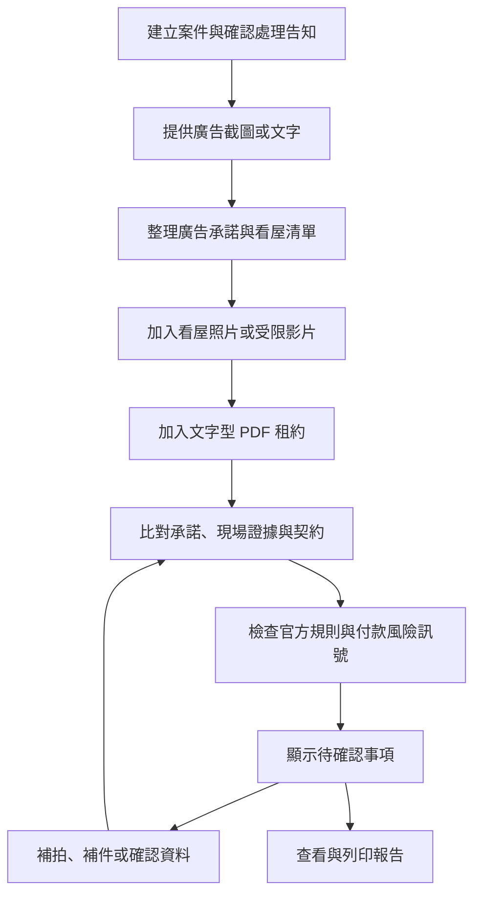
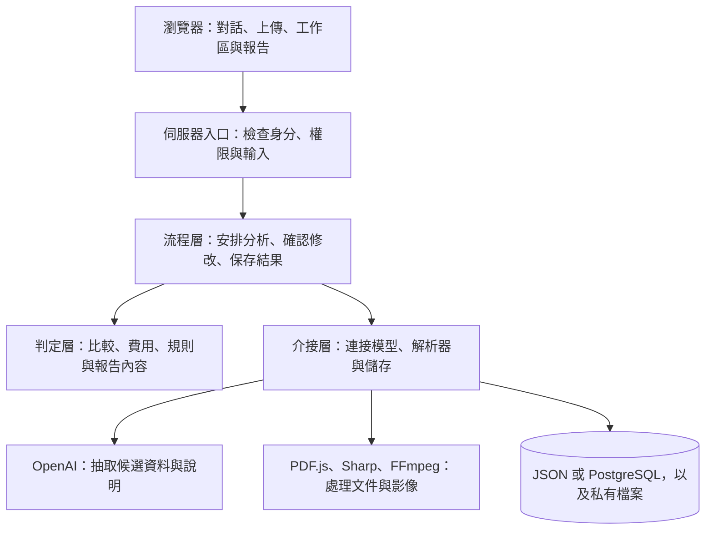
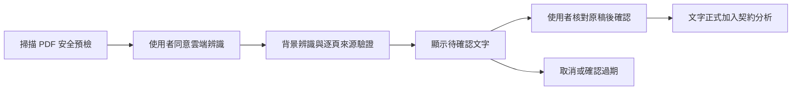

# RentProof 整體技術說明

更新日期：2026-09-05。本文供第一次接觸專案的讀者、合作夥伴與接手工程師閱讀。

RentProof 把租屋廣告、看屋照片、租約及付款互動整理成同一筆案件，協助使用者看清楚：哪些承諾有證據、哪些內容互相矛盾，以及簽約或付款前還需要確認什麼。每個結果都必須能回到原始資料的位置。

本文依目前程式與 D-104 接線結果重寫，涵蓋新完成的掃描租約人工確認、影片背景處理及持久用量限制。它說明系統如何運作，也區分工程功能與正式營運條件；精確資料格式和安全契約仍見文末的專題文件。

## 1. 使用者會得到什麼

假設一則廣告寫著「附洗衣機，電費每度 5 元」。使用者看屋後，上傳照片及租約。RentProof 會分開處理以下問題：

| 提供的資料                                     | 系統如何呈現   | 原因                                 |
| ---------------------------------------------- | -------------- | ------------------------------------ |
| 有清楚、可定位且符合承諾的洗衣機照片           | 支持           | 有對應證據支持這項設備承諾           |
| 所有照片都沒有拍到洗衣機，租約也沒有提到       | 證據不足       | 沒拍到不等於沒有，應補拍或詢問       |
| 同一物件的廣告寫每度 5 元，租約明確寫每度 6 元 | 矛盾           | 兩筆可定位資料對同一費用寫了不同內容 |
| 牆面出現不明變色                               | 補拍或詢問建議 | 單張照片不足以判定漏水原因           |

以上是虛構示例。系統整理證據差異，不提供法律意見，也不判定房屋結構安全、詐騙、責任歸屬或是否可以放心簽約。

費用同樣分開呈現：固定月租、依用量計算的電費，以及押金等一次性款項。沒有用電量時，只能列出單價與計算方式，不能自行產生一個「每月總支出」。

## 2. 一筆案件如何完成

主要介面是對話，讓使用者用日常語言描述需求；完整資料則放在四區證據工作區，包含物件摘要、證據矩陣、契約檢查與簽約前報告。



這張圖描述典型閱讀順序，實際分析依資料相依關係執行。缺少租約時可以先整理廣告與看屋證據，不能把尚未執行的契約檢查當成已通過。

對話本身不是案件事實。例如使用者說「把電費改成 6 元」，系統先整理成待確認的修改內容。只有使用者確認、伺服器驗證身分與案件版本後，才會執行修改。單純詢問既有結果時，則可直接讀取已驗證資料回答。

四區工作區與報告共用同一份分析版本，避免摘要顯示一種結果、契約頁卻使用另一批舊資料。

## 3. 系統由哪些部分組成

RentProof 採用「模組化單體」：網站、後端流程與規則在同一個應用程式中運作，但程式依責任分開。這讓目前的單機部署較容易維護，也保留之後替換儲存方式的空間。



| 部分                  | 負責的事情                               | 為什麼要分開                         |
| --------------------- | ---------------------------------------- | ------------------------------------ |
| 畫面與 API 入口       | 顯示資料、接收請求、檢查存取條件         | 瀏覽器不能自行決定正式分析結果       |
| 流程層（Application） | 決定哪些階段可執行、是否需確認、如何保存 | 集中管理步驟與失敗處理               |
| 判定層（Domain）      | 定義資料與比較規則                       | 不依賴雲端或資料庫也能測試           |
| 介接層（Adapters）    | 呼叫 OpenAI、解析檔案、讀寫儲存          | 外部工具改變時，減少對核心判定的影響 |

流程層透過明確的介面要求「讀取案件」或「抽取契約」，不用知道資料庫查詢或模型 SDK 的細節。專業文件把這些介面稱為 ports，把實際連接工具的程式稱為 adapters。

## 4. AI 負責閱讀，伺服器負責驗證與判定

照片與自然語言不容易用固定字串規則理解，因此使用模型抽取候選內容。但模型回傳的文字仍可能錯誤，必須先經過格式、內容與來源驗證。

| 工作                                     | 目前專案的分工                               |
| ---------------------------------------- | -------------------------------------------- |
| 理解這一輪對話、說明已驗證內容           | Luna 路由，設定為 `gpt-5.6-luna`／`low`      |
| 閱讀廣告、影像、契約與互動資料           | Terra 路由，設定為 `gpt-5.6-terra`／`medium` |
| 產生看屋問題                             | 伺服器依承諾類型套用模板                     |
| 決定支持、矛盾或證據不足                 | 伺服器比較規則                               |
| 計算費用、檢查官方規則、產生風險訊號     | 伺服器程式                                   |
| 安全提醒、確認卡、行動順序與報告核心內容 | 伺服器固定模板                               |

這裡的模型名稱是專案設定紀錄，不是對外部服務即時可用性的保證。Live 能否啟動仍取決於實際專案設定與安全檢查。

文件中的 Listing、Viewing、Evidence、Contract 等 Agent 名稱，代表固定分析階段。它們沒有自行瀏覽任意網站、修改資料庫、繞過權限或任意新增工作的權限。

模型必須回傳符合指定結構的資料。例如一項契約費用需要有類型、值與原文位置，不能只回「看起來沒問題」。即使格式正確，來源找不到、內容對不上或信心不足，也不能產生肯定結論。

廣告網址不代表系統可以任意抓取網頁。一般資料來源以使用者提供的截圖與文字為準；任何額外來源能力都必須受既有允許清單與安全規格約束。

## 5. 如何追溯每一項結果

系統用以下資料把來源和結果串起來：

| 名稱             | 白話意思                                        |
| ---------------- | ----------------------------------------------- |
| Case             | 一筆租屋案件，包含自己的資料與擁有者            |
| Artifact         | 上傳的廣告、照片、租約等素材                    |
| Claim            | 廣告中的一項承諾，例如附洗衣機                  |
| Observation      | 影像中可觀察到的內容                            |
| ContractClause   | 契約中抽取的一段條款                            |
| Locator          | 資料位置，例如 PDF 第幾頁、圖片區域或影片時間點 |
| Finding          | 經驗證後的差異或待確認事項                      |
| StageRun         | 某個分析階段的執行紀錄                          |
| AnalysisSnapshot | 某次完整分析結果的固定版本                      |

例如「電費有差異」必須連回廣告的費用原文與租約對應頁面。使用者才能確認系統是否讀錯，也能把雙方說法放在一起討論。

分析紀錄保留相關的模型、提示詞、資料格式與規則版本。固定分析管線依相依關係決定哪些結果需要更新；Secure LAN 的整案分析目前仍執行三個抽取階段，不能把局部快取設計解讀為所有入口都已免除重複抽取。分析提交會核對案件版本，避免補件後被較舊結果覆蓋。

同一筆重複請求也會辨識是否已處理，避免連按兩次就重複分析。案件版本已變更時，舊確認卡不能繼續套用。

## 6. 三種檢查各自回答不同問題

| 功能         | 回答的問題                                     | 輸出方式                       |
| ------------ | ---------------------------------------------- | ------------------------------ |
| 承諾比對     | 廣告與提供的證據是否一致？                     | 支持、矛盾、證據不足           |
| 官方規則檢查 | 在已知適用條件下，資料與版本化規則是否有差異？ | 未發現差異、疑似差異、資料不足 |
| 付款風險訊號 | 是否出現需要在付款前查證的情況？               | 風險訊號、資料不足與查證行動   |

三者不合成安全分數。「未發現差異」只描述此次資料和檢查範圍，不能延伸為整份契約或交易已獲保證。

官方規則使用保存的來源快照、版本與檔案雜湊，讓團隊能追溯當時採用的依據。實際判斷由允許執行的 TypeScript 規則完成，不直接執行來源網頁或 YAML 中的自然語言。

付款風險可涵蓋看屋前付款、收款角色不明、高壓話術等情況，但必須有對應資料。時間不明就不能猜測付款發生在看屋前；低租金訊號缺少合格官方比較資料時，也應顯示資料不足。

另外的租金補貼預檢頁，使用最小必要的結構化回答檢查申請條件，不呼叫 OpenAI，不要求上傳所得或身分證明，也不提供政府核定金額。它與案件中的契約檢查分開。

## 7. 上傳資料如何處理

檔案不會因為副檔名正確就直接送給模型。伺服器先檢查檔案大小、實際格式與內容，再交由解析器處理；通過驗證後才成為可用素材。

| 類型              | 處理方式與主要限制                                                                                                                      |
| ----------------- | --------------------------------------------------------------------------------------------------------------------------------------- |
| JPEG／PNG 圖片    | 每張最多 25 MiB、解碼後最多 5,000 萬像素；Sharp 校正方向、縮至最長邊 3200 px 且不放大，移除位置等附加資訊；案件原始圖片總量最多 400 MiB |
| 文字型 PDF        | 單份最多 15 MiB、30 頁、抽取文字最多 300,000 字元；PDF.js 逐頁抽取並保留位置，不執行文件中的程式或附件動作                              |
| Secure LAN 的 MP4 | 單份最多 50 MiB、30 秒，最高 4K／60 fps；以鎖版 FFmpeg 每 2 秒抽幀、最多 15 幀，保留時間與幀位置；不分析音訊                            |
| 掃描 PDF          | 與文字型 PDF 使用相同大小／頁數限制；通過安全預檢及這份檔案的雲端處理同意後，在背景辨識。使用者逐頁確認後才加入契約分析                 |

掃描租約的處理分成兩次清楚的使用者操作：先同意把這份 PDF 送去辨識，再對照原始租約確認辨識文字。第一個同意不代表辨識結果正確，系統不會自動幫使用者勾選第二個確認。



確認固定有效 10 分鐘，且只能使用一次。案件、工作階段、政策或內容變更後，舊確認立即失效。辨識文字模糊、缺頁或信心不足時，不會送進肯定判定。

上傳素材保存在私有儲存，不放進網站公開目錄。私有案件的檔案使用加密儲存，讀取仍需檢查案件擁有者。圖片移除附加資訊不代表畫面中的姓名或地址已自動消失。

一般個資疑慮會要求使用者閱讀警告並明確繼續；密碼、驗證碼、API 金鑰、完整金融帳號等高風險秘密則直接拒絕。系統不宣稱能完整偵測所有個資。

## 8. 訪客、帳戶與資料保存

使用者不必先註冊。訪客案件綁定目前的瀏覽器工作階段，只有同一有效工作階段能存取，也不出現在帳戶歷史查詢中。登入後仍需明確選擇保存，系統才會把訪客案件轉移到帳戶。

帳戶採自建 Email／密碼驗證，密碼使用 Argon2id 雜湊保存。瀏覽器拿到的是隨機工作階段憑證，伺服器每次都重新檢查身分與案件權限；知道案件編號並不足以取得內容。

以下是既有保存設計，正式營運仍須完成排程與清除驗收：

| 資料         | 保存與刪除規則                                                                                  |
| ------------ | ----------------------------------------------------------------------------------------------- |
| 訪客工作階段 | 建立後固定 24 小時，不因操作延長；到期立即拒絕存取，線上資料於之後 24 小時內清除                |
| 帳戶案件     | 帳戶有效期間保存至使用者刪除案件或帳戶；確認刪除後立即拒絕一般存取，線上內容於 7 個日曆日內清除 |
| 原始對話文字 | 固定保存 7 天；到期隱藏並於 24 小時內線上清除，較短的案件期限優先                               |
| 備份         | 最多加密保存 14 天；恢復服務前須重播刪除紀錄，避免已刪案件重新出現                              |

原始聊天清除後，已驗證的案件事實與來源關聯可依案件政策保留。報告依據結構化證據，不依賴保留完整聊天來重建結論。

使用條款、隱私告知與雲端處理告知分別記錄版本和事件；目前政策文件都維持 `DRAFT`。

## 9. 雲端呼叫、成本與失敗處理

Fixture 模式使用明確的測試結果，不需要 OpenAI 金鑰，也不發出 OpenAI 請求。Live 模式才會將通過檢查的必要資料由伺服器送往 OpenAI，金鑰不會交給瀏覽器。

每次請求明確設定 `store: false` 與 `service_tier: "default"`。前者是 API 儲存設定，不能解讀成供應商的零資料保留承諾。

應用程式分別限制證據分析和對話的用量：

| 路徑     | 專案設定的上限                                                                                                    |
| -------- | ----------------------------------------------------------------------------------------------------------------- |
| 證據分析 | 每案最多 16 次實際 provider attempts、同時 2 個請求、累計 500,000 input tokens、50,000 output＋reasoning tokens   |
| 對話     | 每案固定 24 小時視窗內最多 200 次 attempts、同時 1 個請求、500,000 input tokens、100,000 output＋reasoning tokens |

Tokens 是模型計量文字及其他輸入輸出的單位；以上是工程限制，不是帳單金額保證。雲端專案的費用與速率設定還需要獨立確認。

Secure LAN 的 OCR 與證據分析共用資料庫用量帳本。呼叫前先保留額度，完成後再核對實際用量；伺服器重啟不會清空計數。中斷且無法確認用量的請求保留限制，不當作免費或零用量重新開始。

2026-09-05 已實際呼叫 OpenAI：Luna 與 Terra 的連線測試通過，廣告、看屋照片與文字型 PDF 契約三個抽取階段也完成真實 Live 驗收，並在 HTTPS 網站取得同一案件的成功分析回應。測試使用封存展示素材，不是把預先分析結果當成即時輸出。這次確認的是指定素材的處理流程與來源驗證，不能推論所有租約或影像都有相同準確度；遠端後台的月額度設定沒有重新審核。

驗收同時修正了契約字元位置問題：模型引用正確原文但計數錯誤時，伺服器只會在指定頁面找到唯一、逐字相同的文字後重新定位。找不到或有歧義仍拒絕，不靠猜測補出來源。

遇到拒絕回答、回應未完成、格式錯誤、來源不符、額度不足或服務失敗，系統保留各自的錯誤原因。Live 失敗不會偷偷改用預先準備的結果，也不會顯示成「沒有問題」。

## 10. 目前如何執行與部署

目前允許本機開發與私人區域網路 HTTPS 展示，沒有正式公開網站。這兩種環境都在目前 Windows 開發機驗證。

| 模式                   | 用途                                                                                        |
| ---------------------- | ------------------------------------------------------------------------------------------- |
| `local_development`    | HTTP 僅綁定 `127.0.0.1`，供本機開發及測試                                                   |
| `lan_secure_demo`      | 使用 Production Build、受信任 HTTPS、指定私人 IP 與受限防火牆規則，供同一私人網路跨裝置展示 |
| `public_http_showcase` | 停用，不得建立或部署公開展示                                                                |
| 正式 Production        | 尚未完成正式上線條件，作業系統也尚未決定                                                    |

本機測試保留 JSON 儲存方式；Secure LAN 私有案件使用 PostgreSQL 與加密私有檔案。資料庫只接受本機連線，不直接開放給手機、區域網路或網際網路。

Demo 素材放在 repository 外的既有 `RentProof-Demo` 目錄，應用程式只能讀取。素材版本封存後會檢查清單與雜湊；檔案缺失或不符時，不能自行生成或偷換另一版本。

影片與掃描 PDF 上傳會先回報「已排入處理」，由背景執行器處理，瀏覽器另行查詢進度。影片抽幀完成後才加入案件；OCR 則先停在人工確認。使用者可取消處理，刪除案件也會使未完成工作失效。

LAN 將工作清單與處理紀錄保存在 PostgreSQL，最多同時處理兩件工作，同一案件同時一件。執行器每 20 秒更新一次 60 秒的執行租約；這裡的「租約」是工作執行權期限，與使用者上傳的租屋契約無關。伺服器異常中止後，過期工作可在 runtime 恢復時重新檢查。完整分析目前仍由原本的同步入口執行，多台伺服器與高可用性尚未驗收。

## 11. 工程師從哪裡開始

目前鎖定的主要工具是 Node.js 24.20.0、pnpm 11.25.0、Next.js 16.3.4、React 19.2.8 與 TypeScript 6.0.3；精確依賴以根目錄的 `package.json` 和 `pnpm-lock.yaml` 為準。

| 目錄               | 閱讀重點                           |
| ------------------ | ---------------------------------- |
| `src/app/`         | 網頁路由與 API 入口                |
| `src/components/`  | 對話、工作區及其他畫面元件         |
| `src/application/` | 分析流程、上傳、確認與各項使用案例 |
| `src/domain/`      | 資料格式、比較、官方規則及風險訊號 |
| `src/adapters/`    | 模型、文件處理、資料庫與檔案儲存   |
| `src/server/`      | 啟動設定、權限、網路與功能組裝     |
| `rules/`           | 版本化規則及官方來源快照           |
| `scripts/`         | 環境檢查、啟停及維護工具           |
| `docs/`            | 規格、決策、操作說明與開發紀錄     |

在專案根目錄開始：

```powershell
pnpm install --frozen-lockfile
pnpm env:check
pnpm dev
```

需要 Golden Demo 時，先依 README 準備 repository 外的封存素材及明確版本，再執行 `pnpm demo:check`。LAN 啟動涉及憑證、防火牆與資料庫，請依 [Server 配置](SERVER_CONFIGURATION.md) 操作，不能只把開發主機改成 `0.0.0.0`。

品質檢查分開執行格式、Lint、TypeScript、單元測試、安全檢查與瀏覽器測試。Vitest 驗證判定與流程；Testing Library 驗證操作；Playwright 與 axe 驗證瀏覽器及無障礙。瀏覽器測試前必須先完成 build。

關鍵測試包括「沒拍到洗衣機必須是證據不足」、矛盾必須有相反來源、低信心或缺少位置不得肯定、不同使用者不能互讀案件，以及重複請求不重複呼叫模型。

本次新增測試涵蓋 OCR 逐頁定位、明確確認、過期、重複確認、案件版本變更、背景取消、工作續期及用量恢復。實際 PostgreSQL 測試證明兩個同時送出的確認只有一個成功，並驗證權限撤銷與測試資料清除。測試結果與交付 Gate 記錄於 [開發紀錄](DEVLOG.md)。自動測試不取代人工螢幕閱讀器與真實手機驗收。

## 12. 已有能力與仍待完成的工作

| 範圍                               | 整理時的狀態                                                                        |
| ---------------------------------- | ----------------------------------------------------------------------------------- |
| 對話、證據工作區、補件與列印報告   | 已有實作與測試紀錄                                                                  |
| 訪客、自建帳戶、歷史案件與私有儲存 | 已接入受控開發／LAN 環境，正式營運仍有驗收缺口                                      |
| 圖片、文字型 PDF、受限 MP4         | 已有入口；影片音訊不分析                                                            |
| 掃描 PDF OCR                       | 已接入背景辨識、逐頁人工確認及契約抽取；付費 Live 仍受 Cloud／Project Gate 限制     |
| 防詐訊號                           | FRS-001 至 FRS-010 已有 evaluators 與整合紀錄，能否評估仍取決於啟用設定與資料完整性 |
| 租金補貼                           | 已有 115 年度條件預檢，不包含核定金額或正式資格認定                                 |
| 工作佇列                           | OCR／影片入口已接線進度查詢與取消；LAN 有 PostgreSQL 持久化，尚未驗收多 process／HA |
| 正式上線                           | 尚待正式網域、Email 營運控制、排程清除、異地加密備份、事件處理、部署與政策專業審閱  |

## 13. 想進一步了解時

| 想了解的內容                     | 對應文件                                                                             |
| -------------------------------- | ------------------------------------------------------------------------------------ |
| 產品要解決的問題與使用流程       | [產品規格](PRODUCT_SPEC.md)                                                          |
| 模組邊界、流程相依與儲存架構     | [系統架構](SYSTEM_ARCHITECTURE.md)                                                   |
| 資料格式、比較演算法與 API       | [技術設計](TECHNICAL_DESIGN.md)                                                      |
| 畫面、手機版與列印               | [UI 設計](UI_DESIGN.md)                                                              |
| 模型路由、用量與錯誤             | [OpenAI 整合](OPENAI_INTEGRATION.md)                                                 |
| 安全、資料外送與檔案防護         | [安全與隱私](SECURITY_PRIVACY.md)                                                    |
| 登入、訪客、歷史與刪除           | [帳戶與歷史](AUTH_AND_HISTORY.md)                                                    |
| 伺服器啟動與 LAN 條件            | [Server 配置](SERVER_CONFIGURATION.md)                                               |
| 影片、OCR 與工作佇列進度         | [影片](VIDEO_INGESTION_P1.md)、[OCR](OCR_DESIGN.md)、[工作佇列](JOB_QUEUE_DESIGN.md) |
| 為什麼做這些選擇、實際完成了什麼 | [決策紀錄](DECISIONS.md)、[開發紀錄](DEVLOG.md)                                      |
